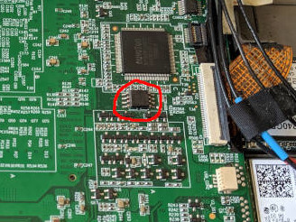

# 51NB X210

## Extracting vendor EC firmware

EC firmware is included in the SPI image. To extract it, run:

``
dd bs=64K skip=32 count=1 if=bios.rom of=ec.bin
``

and ensure that you have a file that includes the string "Insyde Software Corp"

## Flashing instructions

This can be performed using the internal SPI controller, even when flashing
from stock firmware. Use flashrom -p internal and follow the appropriate
flashrom instructions to force it. Alternatively, external flashing has been
tested with Dediprog SF100 and SF600 and using a Beaglebone Black. The flash
is located on the upper side of the motherboard, below the keyboard
connector. It is circled in red here:


## Flashing a subset of the ROM

If you want to flash coreboot without extracting firmware blobs, you can
flash coreboot without overwriting those blobs. After building coreboot,
create a layout file with the following content:

```
00000000:001fffff me
00200000:0020ffff ec
00210000:007fffff main
```

and run flashrom with the "--layout rom.layout --image main" arguments. This
will flash the main firmware without overwriting the existing EC or ME
firmware.

## Working

All hardware features are believed to be working, although the SD reader is
untested. Note that certain hotkeys don't work (including the Thinkvantage
button) - this is a limitation of the EC firmware, and these keys also
generate no events under the stock vendor firmware.

