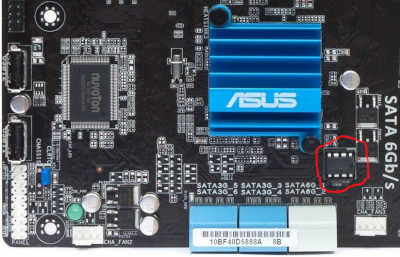

# ASUS P8C WS

This page describes how to run coreboot on the [ASUS P8H77-V].

## Flashing coreboot

```{eval-rst}
+---------------------+----------------+
| Type                | Value          |
+=====================+================+
| Socketed flash      | yes            |
+---------------------+----------------+
| Model               | W25Q64FVA1Q    |
+---------------------+----------------+
| Size                | 8 MiB          |
+---------------------+----------------+
| Package             | DIP-8          |
+---------------------+----------------+
| Write protection    | no             |
+---------------------+----------------+
| Dual BIOS feature   | no             |
+---------------------+----------------+
| Internal flashing   | yes            |
+---------------------+----------------+
```

The flash IC is located beside the SATA ports (circled):


### How to flash

Unlike ordinary desktop boards, the BIOS version 3202 of ASUS P8C WS does not
apply any write protection, so the main SPI flash can be accessed using
[flashrom], and the whole flash is writable.

The following command may be used to flash coreboot. (To do so, linux kernel
should be started with `iomem=relaxed`)

```
# flashrom -p internal -w coreboot.rom
```

The flash chip is a socketed DIP-8 SPI flash, so it's also easy to remove and
flash externally.

## Working
- Intel Xeon E3-1225 V2 with 4 M391B1G73BH0-YK0 UDIMMs, ECC confirmed active
- PS/2 keyboard with SeaBIOS 1.14.0 and Debian GNU/Linux with kernel 5.10.40
- Both Onboard NIC
- S3 Suspend to RAM
- USB2 on rear and front panel connectors
- USB3
- Integrated SATA
- CPU Temp sensors (tested PSensor on GNU/Linux)
- LPC TPM on TPM-header (tested tpm-tools with TPM 1.2 Infineon SLB9635TT12)
- Native raminit
- Integrated graphics with libgfxinit (both analog and digital output from DVI-I)
- Nvidia Quadro 600 in all PCIe-16x slots
- Compex WLM200NX (Qualcomm Atheros AR9220) in PCI slot
- Onboard IEEE1394 controller under PCI bus
- Debug output from serial port

## Untested

- EHCI debugging
- S/PDIF audio
- PS/2 mouse
- LPT port

## Technology

```{eval-rst}
+------------------+--------------------------------------------------+
| Northbridge      | :doc:`../../northbridge/intel/sandybridge/index` |
+------------------+--------------------------------------------------+
| Southbridge      | bd82x6x                                          |
+------------------+--------------------------------------------------+
| CPU              | model_206ax                                      |
+------------------+--------------------------------------------------+
| Super I/O        | Nuvoton NCT6776F                                 |
+------------------+--------------------------------------------------+
| EC               | None                                             |
+------------------+--------------------------------------------------+
| Coprocessor      | Intel Management Engine                          |
+------------------+--------------------------------------------------+
```

## Extra resources

- [Flash chip datasheet][W25Q64FVA1Q]

[ASUS P8C WS]: https://www.asus.com/supportonly/p8c_ws/helpdesk_knowledge/
[W25Q64FVA1Q]: https://www.winbond.com/resource-files/w25q64fv%20revs%2007182017.pdf
[flashrom]: https://flashrom.org/
