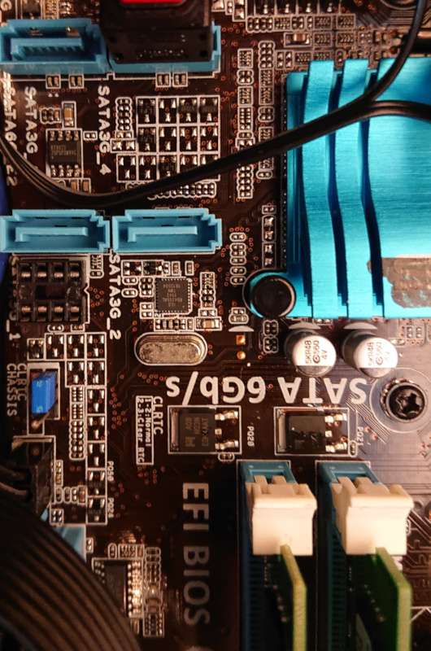

# ASUS P8H61-M Pro

This page describes how to run coreboot on the [ASUS P8H61-M Pro].

## Flashing coreboot

```{eval-rst}
+---------------------+------------+
| Type                | Value      |
+=====================+============+
| Socketed flash      | yes        |
+---------------------+------------+
| Model               | W25Q32BV   |
+---------------------+------------+
| Size                | 4 MiB      |
+---------------------+------------+
| Package             | DIP-8      |
+---------------------+------------+
| Write protection    | no         |
+---------------------+------------+
| Dual BIOS feature   | no         |
+---------------------+------------+
| Internal flashing   | yes        |
+---------------------+------------+
```

The flash IC is located right next to one of the SATA ports:


### Internal programming

The main SPI flash can be accessed using [flashrom]. By default, only
the BIOS region of the flash is writable. If you wish to change any
other region (Management Engine or flash descriptor), then an external
programmer is required.

The following command may be used to flash coreboot:

```
$ sudo flashrom --noverify-all --ifd -i bios -p internal -w coreboot.rom
```

The use of `--noverify-all` is required since the Management Engine
region is not readable even by the host.

## Known issues

- There is no automatic, OS-independent fan control. This is because
  the Super I/O hardware monitor can only obtain valid CPU temperature
  readings from the PECI agent, whose complete initialisation is not
  publicly documented. The `coretemp` driver can still be used for
  accurate CPU temperature readings.

- me_cleaner breaks LPC bus and attached components!
- PS/2 mouse doesn't work

## Untested

- parallel port
- EHCI debug
- S/PDIF audio

## Working

- PS/2 keyboard
- PCIe graphics
- USB
- Gigabit Ethernet
- Integrated graphics
- SATA
- Serial port
- hardware monitor (see [Known issues](#known-issues) for caveats)
- front panel audio
- Native raminit (2 x 2GB, DDR3-1333)
- Native graphics init (libgfxinit)
- Wake-on-LAN
- TPM on TPM-header

## Technology

```{eval-rst}
+------------------+--------------------------------------------------+
| Northbridge      | :doc:`../../northbridge/intel/sandybridge/index` |
+------------------+--------------------------------------------------+
| Southbridge      | bd82x6x                                          |
+------------------+--------------------------------------------------+
| CPU              | model_206ax                                      |
+------------------+--------------------------------------------------+
| Super I/O        | Nuvoton NCT6776                                  |
+------------------+--------------------------------------------------+
| EC               | None                                             |
+------------------+--------------------------------------------------+
| Coprocessor      | Intel Management Engine                          |
+------------------+--------------------------------------------------+
```

## Extra resources

- [Flash chip datasheet][W25Q32BV]

[ASUS P8H61-M Pro]: https://www.asus.com/Motherboards/P8H61M_Pro/
[W25Q32BV]: https://www.winbond.com/resource-files/w25q32bv_revi_100413_wo_automotive.pdf
[flashrom]: https://flashrom.org/
