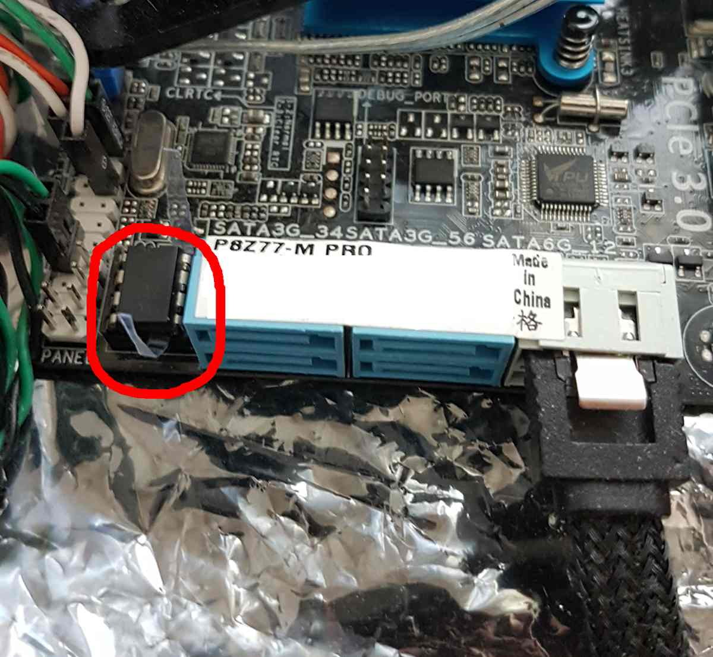

# ASUS P8Z77-M PRO

This page describes how to run coreboot on the [ASUS P8Z77-M PRO]

## Flashing coreboot

```eval_rst
+---------------------+----------------+
| Type                | Value          |
+=====================+================+
| Socketed flash      | yes            |
+---------------------+----------------+
| Model               | W25Q64FVA1Q    |
+---------------------+----------------+
| Size                | 8 MiB          |
+---------------------+----------------+
| Package             | DIP-8          |
+---------------------+----------------+
| Write protection    | yes            |
+---------------------+----------------+
| Dual BIOS feature   | no             |
+---------------------+----------------+
| Internal flashing   | yes            |
+---------------------+----------------+
```

The flash IC is located right next to one of the SATA ports:


### Internal programming

The main SPI flash cannot be written because Asus disables BIOSWE and
enables BLE/SMM_BWP flags in BIOS_CNTL for their latest bioses.
An external programmer is required. You must flash standalone,
flashing in-circuit doesn't work. The flash chip is socketed, so it's
easy to remove and reflash.

## Working

- PS/2 keyboard with SeaBIOS & edk2 (in Mint 18.3/19.1)

- Rear/front headphones connector audio & mic

- S3 Suspend to RAM (tested with OS installed in a HDD/SSD and also with a
  Mint 18.3/19.1 LiveUSB pendrive connected to USB3/USB2), but please
  see [Known issues]

- USB2 on rear (tested mouse/keyboard plugged there. Also, booting with
  a Mint 18./19.1 LiveUSB works ok)

- USB3 (Z77's and Asmedia's works, but please see [Known issues])

- Gigabit Ethernet (RTL8111F)

- SATA3, SATA2 and eSATA (tested on all ports, hot-swap and TCG OPAL working)
    (Blue SATA2)  (Blue SATA2)  (White SATA3)  (Red eSATA SATA3 rear)
       port 3        port 5         port 1             port 8
       port 4        port 6         port 2             port 7

- NVME SSD boot on PCIe-x16/x8/4x slot using edk2
  (tested with M.2-to-PCIe adapter and a M.2 Samsung EVO 970 SSD)

- CPU Temp sensors (tested PSensor on linux + HWINFO64 on Win10)

- TPM on TPM-header (tested tpm-tools with Asus TPM 1.2 Infineon SLB9635TT12)

- Native raminit and also MRC.bin(systemagent-r6.bin) memory initialization
  (please see [Native raminit compatibility] and [MRC memory compatibility])

- Integrated graphics with both libgfxinit and the Intel Video BIOS OpROM
  (VGA/DVI-D/HDMI tested and working)

- 1x PCIe GPU in PCIe-16x/8x/4x slots (tested using Zotac GeForce GTX
  750Ti and FirePro W5100 under Mint 18.3/19.1)

## Known issues

- The rear's USB3s on bottom (closest to the PCB) have problems booting or
  being used before the OS loads. For better compatibility, please use
  the Z77's ones above the Ethernet connector or the Asmedia's top one

- After S3 suspend, some USB3 connectors on rear seem not to work

- At the moment, the power led does not blink when entering S3 state

- Currently, we have not setup the SuperIO's Hardware Monitor (HWM),
  so only the CPU sensors are reported

- If you use the MRC.bin, the NVRAM variable gfx_uma_size may be ignored
  as IGP's UMA could be reconfigured by the blob

- Using edk2 + a PCIe GPU under Windows crashes with an
  ACPI_BIOS_ERROR fatal code, not sure why. Using just the IGP
  works perfectly

- Under Windows 10, if you experiment problems with PS/2 devices, change
  HKLM\SYSTEM\CurrentControlSet\Services\i8042prt->Start from '3' to '1'

## Untested

- EHCI debugging
- S/PDIF audio
- Wake-on-LAN
- Serial port

## Not working

- PS/2 keyboard in Win10 using edk2 (please see [Known issues])
- PS/2 mouse using edk2
- PCIe graphics card on Windows and edk2 (throws critical ACPI_BIOS_ERROR)

## Native raminit compatibility

- GSkill F3-2133C10D-16GAB(XMP,1.60v) 2x8GB kit works at 1333Mhz instead
  of XMP 2133Mhz

- Team Xtreem TXD38G2133HC9NDC01(XMP,1.50v) 2x4GB kit works at 1600Mhz
  instead of XMP 2133Mhz

- Kingston KVR1066D3N7K2/4G(JEDEC,1.50v) 2x4GB kit works at 1066Mhz
  but the board only detects half its RAM, because those DIMMs have
  Double Sided(DS) chips and seems only Single Sided(SS) ones are
  fully detected

- GSkill F3-10666CL9T2-24GBRL(JEDEC,1.50v) 6x4GB kit (4 DIMMs used)
  works perfectly at full speed (1333Mhz)

## MRC memory compatibility

- GSkill F3-2133C10D-16GAB(XMP,1.60v) 2x8GB kit works at 1333Mhz
  instead of XMP 2133Mhz

- Team Xtreem TXD38G2133HC9NDC01(XMP,1.50v) 2x4GB kit works at
  1600Mhz instead of XMP 2133Mhz

- Kingston KVR1066D3N7K2/4G(JEDEC,1.50v) 2x4GB kit works at 1066Mhz
  but the board only detects half its RAM, as those DIMMs have
  Double Sided(DS) chips and seems only Single Sided(SS) ones are
  fully detected

- GSkill F3-10666CL9T2-24GBRL(JEDEC,1.50v) 6x4GB kit (4 DIMMs used)
  works perfectly at full speed (1333Mhz)

## Technology

```eval_rst
+------------------+--------------------------------------------------+
| Northbridge      | :doc:`../../northbridge/intel/sandybridge/index` |
+------------------+--------------------------------------------------+
| Southbridge      | bd82x6x                                          |
+------------------+--------------------------------------------------+
| CPU              | model_206ax                                      |
+------------------+--------------------------------------------------+
| Super I/O        | Nuvoton NCT6779D                                 |
+------------------+--------------------------------------------------+
| EC               | None                                             |
+------------------+--------------------------------------------------+
| Coprocessor      | Intel Management Engine                          |
+------------------+--------------------------------------------------+
```

## Extra resources

- [Flash chip datasheet][W25Q64FVA1Q]

[ASUS P8Z77-M PRO]: https://www.asus.com/Motherboards/P8Z77M_PRO/
[W25Q64FVA1Q]: https://www.winbond.com/resource-files/w25q64fv%20revs%2007182017.pdf
[flashrom]: https://flashrom.org/Flashrom
