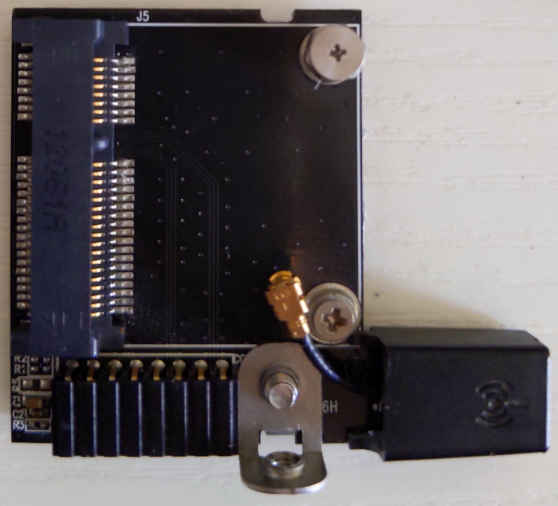

# Asus Wi-Fi Go! v1

In this version, a standard half-length mPCIe card is mounted on the Asus Wi-Fi
Go! daughter board, and the daughter board is connected to the motherboard
through a proprietary 16-1 pin connector.


I managed to grope the most pinout of the proprietary connector.
See [Mini PCIe pinout] for more info.

```eval_rst
+------------+----------+-----------+------------+----------+-----------+
| WIFIGO Pin | Usage    | mPCIe pin | WIFIGO Pin | Usage    | mPCIe pin |
+============+==========+===========+============+==========+===========+
| 1          | 3.3v     | (many)    | 2          | REFCLK-  | 11        |
+------------+----------+-----------+------------+----------+-----------+
| 3          | GND      | (many)    | 4          | REFCLK+  | 13        |
+------------+----------+-----------+------------+----------+-----------+
| 5          | WAKE#    | 1         | 6          | PERn0    | 23        |
+------------+----------+-----------+------------+----------+-----------+
| 7          | (absent) |           | 8          | PERp0    | 25        |
+------------+----------+-----------+------------+----------+-----------+
| 9          | GND      |           | 10         | PETn0    | 31        |
+------------+----------+-----------+------------+----------+-----------+
| 11         | PERST#   | 20        | 12         | PETp0    | 33        |
+------------+----------+-----------+------------+----------+-----------+
| 13         | GND      |           | 14         | (USBD-?) | (36?)     |
+------------+----------+-----------+------------+----------+-----------+
| 15         | 3.3v     |           | 16         | (USBD+?) | (38?)     |
+------------+----------+-----------+------------+----------+-----------+
```

There are two kinds of daughter boards using this connector. One among them has
one MMCX antenna connector, the other has two antenna connectors and USB lane
wired (this kind may be called BT Go!). I can only obtain the former, so I
cannot confirm the exact way the USB data lane gets wired.


## Extra resources
[Mini PCIe pinout]: https://pinoutguide.com/Slots/mini_pcie_pinout.shtml
