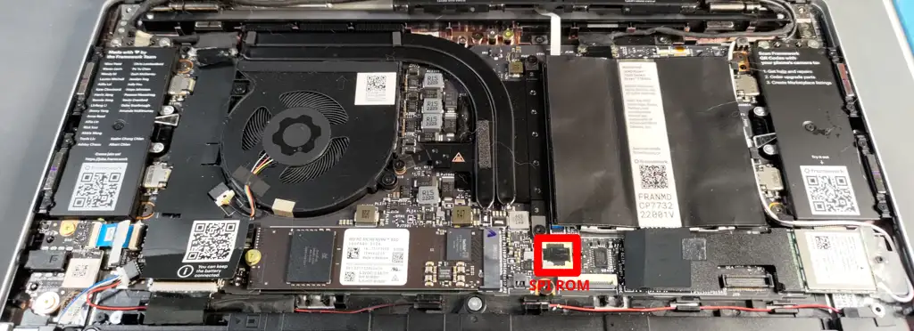

# Framework Laptop 13 AMD Ryzen 7040 Series (Azalea)

## Notice
**This firmware is not production quality**, and is being developed only as a
proof-of-concept. AMD's FSP and openSIL firmwares for the Phoenix SoC are not
fully featured. It is recommended that you do not replace the OEM Firmware on
your Azalea board if you are using it as a daily-driver laptop.

Most notably, suspend is not supported in this firmware. You should in theory
still be able to use hibernate from the OS, but S3 and S0i3 are not being
developed or tested.

## Azalea Platform Specs
- CPU
  - AMD Ryzen 5 7640U (4.9GHz, 6-cores) or
  - AMD Ryzen 7 7840U (5.1Ghz, 8 cores)
- Memory
  - 2 DDR5 SO-DIMM slots - Each accepting 32GiB DDR5-5600 SO-DIMMs
- Storage
  - 2280 M.2 M-Key slot - 1 NVMe M.2 SSD
- WIFI/BT:
  - 2230 M.2 E-Key slot
  - Comes with AMD RZ616 Wi-Fi 6E / BT 5.2
  - Intel modules tend not to work
- Battery
  - Compatible with: 55Wh, 61Wh, 74Wh
- Ports
  - 4 expansion slots
- Audio
  - Realtek ALC295 Codec
  - 3.5mm combo headphone jack
- EC
  - Nuvoton NPCX993

## Mainboard


Notice that the SPI ROM here is socketed. For mass-production devices, it's
soldered down.

## Flashing coreboot
```{eval-rst}
+---------------------+--------------------------------+
| Type                | Value                          |
+=====================+================================+
| Socketed flash      | no                             |
+---------------------+--------------------------------+
| Vendor              | GigaDevice or Winbond          |
+---------------------+--------------------------------+
| Model               | 25LR256EYIG or 25Q256JWEQ      |
+---------------------+--------------------------------+
| Size                | 32 MiB                         |
+---------------------+--------------------------------+
| Voltage             | 1.8V                           |
+---------------------+--------------------------------+
| In circuit flashing | Yes, if header is populated    |
+---------------------+--------------------------------+
| Package             | WSON8                          |
+---------------------+--------------------------------+
| Write protection    | No                             |
+---------------------+--------------------------------+
| Internal flashing   | Yes                            |
+---------------------+--------------------------------+
```

## Update instructions

### Warning
**Before flashing, make sure you have a hardware flash tool to recover the
system.**

**This procedure can render your laptop un-bootable until the ROM chip is
updated.**

**The coreboot project assumes no liability for firmware that does not work as
expected.**

### Flashing Notes
Before starting, please look over the
[Flashing firmware tutorial](https://doc.coreboot.org/tutorial/flashing_firmware/index.html)
and make a backup of *your* ROM chip to recover if anything goes wrong.

The typical way to flash a chip still attached to a board is to use a test clip
of some sort which allows you to connect an external programmer to the pins of
the SPI ROM or pads on the mainboard. These can be found for sale in various
places by searching for "WSON8 test clip". An SOIC8 test clip (commonly referred
to generically as "pomona clips") may work as well.

There are a number of hardware flash tools which can be used. *Make sure you
pick a programmer that supports 1.8V flashing.* You can damage your board by
flashing at 3.3V or 5V. Professional developers tend to use the
[Dediprog SF100](https://web.archive.org/web/20260210001456/https://www.dediprog.com/product/SF100),
but that's a very expensive tool for someone only doing this once.

## Schematics and Pinout information

### Partial Mainboard Schematic
A block diagram and partial mainboard schematic has been released by Framework
Computer Inc under the CC By 4.0 license.
[The schematic is available on their github site.](https://github.com/FrameworkComputer/Framework-Laptop-13/blob/main/Mainboard/Mainboard_Interfaces_Schematic_7040_Series.pdf)

### Pinouts
- [Webcam Interface Pinout](https://github.com/FrameworkComputer/Framework-Laptop-13/tree/main/Mainboard#webcam-interface)
- [EDP Mainboard Interface Pinout](https://github.com/FrameworkComputer/Framework-Laptop-13/tree/main/Mainboard#display-interface)
- [Audio Board Interface Pinout](https://github.com/FrameworkComputer/Framework-Laptop-13/tree/main/Mainboard#audio-board-interface)
- [Speaker Interface Pinout](https://github.com/FrameworkComputer/Framework-Laptop-13/tree/main/Mainboard#speaker-interface)
- [Battery Interface Pinout](https://github.com/FrameworkComputer/Framework-Laptop-13/tree/main/Mainboard#battery-interface)
- [Input Cover (Keyboard/Trackpad) Interface Pinout](https://github.com/FrameworkComputer/Framework-Laptop-13/tree/main/Mainboard#input-cover-interface)
- [Fan Interface Pinout](https://github.com/FrameworkComputer/Framework-Laptop-13/tree/main/Mainboard#fan-interface)
