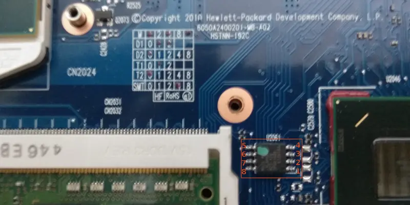

# HP EliteBook 2560p

This page is about the notebook [HP EliteBook 2560p].

## Release status

HP EliteBook 2560p was released in 2011 and is now end of life.
It can be bought from a secondhand market like Taobao or eBay.

## Required proprietary blobs

The following blobs are required to operate the hardware:
1. EC firmware
2. Intel ME firmware

EC firmware can be retrieved from the HP firmware update image, or the firmware
backup of the laptop. EC Firmware is part of the coreboot build process.
The guide on extracting EC firmware and using it to build coreboot is in
document [HP Laptops with KBC1126 Embedded Controller](hp_kbc1126_laptops).

Intel ME firmware is in the flash chip. It is not needed when building coreboot.

## Programming

The flash chip is located between the memory slots and the PCH,
covered by the base enclosure, which needs to be removed according to
the [Maintenance and Service Guide] to access the flash chip. An SPI
flash programmer using 3.3V voltage such as a ch341a programmer, and
an SOIC-8 clip can be used to read and flash the chip in-circuit.

Pin 1 of the flash chip is at the side near the PCH.



For more details have a look at the general [flashing tutorial].

## Debugging

The board can be debugged with EHCI debug. The EHCI debug port is the back
bottom USB port.

Schematic of this laptop can be found on [Lab One].

## Test status

### Known issues

- GRUB payload freezes if at_keyboard module is in the GRUB image
  ([bug #141])

### Untested

- Optical Drive
- VGA
- Fingerprint Reader
- Modem

### Working

- Integrated graphics init with libgfxinit
- SATA
- Audio: speaker and microphone
- Ethernet
- WLAN
- WWAN
- Bluetooth
- ExpressCard
- SD Card Reader
- SmartCard Reader
- eSATA
- USB
- DisplayPort
- Keyboard, touchpad and trackpoint
- EC ACPI support and thermal control
- Dock: all USB ports, DisplayPort, eSATA
- TPM
- Internal flashing when IFD is unlocked
- Using `me_cleaner`


## Technology

```eval_rst
+------------------+--------------------------------------------------+
| CPU              | Intel Sandy/Ivy Bridge (FCPGA988)                |
+------------------+--------------------------------------------------+
| PCH              | Intel Cougar Point QM67                          |
+------------------+--------------------------------------------------+
| EC               | SMSC KBC1126                                     |
+------------------+--------------------------------------------------+
| Coprocessor      | Intel Management Engine                          |
+------------------+--------------------------------------------------+
```

[HP EliteBook 2560p]: https://support.hp.com/us-en/product/hp-elitebook-2560p-notebook-pc/5071201
[Maintenance and Service Guide]: http://h10032.www1.hp.com/ctg/Manual/c03011618
[flashing tutorial]: ../../tutorial/flashing_firmware/ext_power.md
[Lab One]: https://www.laboneinside.com/hp-elitebook-2560p-schematic-diagram/
[bug #141]: https://ticket.coreboot.org/issues/141
