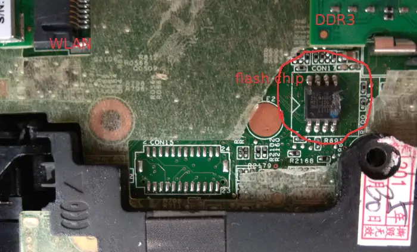

# HP EliteBook 8560w

This page describes how to run coreboot on the [HP EliteBook 8560w].

## Required proprietary blobs

- Intel Firmware Descriptor, ME and GbE firmware
- EC: please read [HP Laptops with KBC1126 Embedded Controller](hp_kbc1126_laptops)

## Flashing instructions

When running vendor firmware, external flashing is needed.

HP EliteBook 8560w has an 8MiB SOIC-8 flash chip on the bottom of the
mainboard. You just need to remove the service cover, and use an SOIC-8
clip to read and flash the chip.



```{eval-rst}
+---------------------+------------+
| Type                | Value      |
+=====================+============+
| Socketed flash      | no         |
+---------------------+------------+
| Model               | MX25L6406E |
+---------------------+------------+
| Size                | 8 MiB      |
+---------------------+------------+
| Package             | SOIC-8     |
+---------------------+------------+
| Write protection    | no         |
+---------------------+------------+
| Dual BIOS feature   | no         |
+---------------------+------------+
| In circuit flashing | yes        |
+---------------------+------------+
| Internal flashing   | yes        |
+---------------------+------------+
```

## Working

- i7-2720QM, 8G+8G
- Arch Linux boot from SeaBIOS payload
- EHCI debug: the port is beside the eSATA port
- SATA
- eSATA
- USB2 and USB3
- keyboard
- Gigabit Ethernet
- WLAN
- WWAN
- VGA and DisplayPort
- audio
- EC ACPI
- Using `me_cleaner`
- dock: PS/2 keyboard, USB, DisplayPort
- TPM
- S3 suspend/resume

## Technology

```{eval-rst}
+------------------+--------------------------------------------------+
| Northbridge      | :doc:`../../northbridge/intel/sandybridge/index` |
+------------------+--------------------------------------------------+
| Southbridge      | bd82x6x                                          |
+------------------+--------------------------------------------------+
| CPU              | model_206ax                                      |
+------------------+--------------------------------------------------+
| Super I/O        | SMSC LPC47n217                                   |
+------------------+--------------------------------------------------+
| EC               | SMSC KBC1126                                     |
+------------------+--------------------------------------------------+
| Coprocessor      | Intel Management Engine                          |
+------------------+--------------------------------------------------+
```

[HP EliteBook 8560w]: https://support.hp.com/us-en/product/hp-elitebook-8560w-mobile-workstation/5071171
