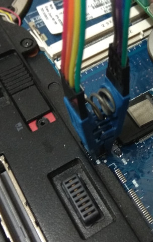

# HP EliteBook 8760w

This page describes how to run coreboot on the [HP EliteBook 8760w].

The coreboot code for this laptop is still not merged, you need to
checkout the [code on gerrit] to build coreboot for the laptop.

## Flashing coreboot

```eval_rst
+---------------------+------------+
| Type                | Value      |
+=====================+============+
| Socketed flash      | no         |
+---------------------+------------+
| Model               | W25Q64.V   |
+---------------------+------------+
| Size                | 8 MiB      |
+---------------------+------------+
| Package             | SOIC-8     |
+---------------------+------------+
| Write protection    | no         |
+---------------------+------------+
| Dual BIOS feature   | no         |
+---------------------+------------+
| In circuit flashing | yes        |
+---------------------+------------+
| Internal flashing   | yes        |
+---------------------+------------+
```

## Required proprietary blobs

- Intel Firmware Descriptor, ME and GbE firmware
- EC: please read [HP Laptops with KBC1126 Embedded Controller](hp_kbc1126_laptops)

## Flashing instructions

HP EliteBook 8760w has an 8 MiB SOIC-8 flash chip on the bottom of the
mainboard. You just need to remove the service cover, and use an SOIC-8
clip to read and flash the chip.



## Untested

- dock: serial port, parallel port, ...
- TPM
- S3 suspend/resume
- Gigabit Ethernet

## Working

- i7-2630QM, 0+4G+8G+0
- i7-3720QM, 8G+8G+8G+8G
- Arch Linux boot from SeaBIOS payload
- EHCI debug: the port is at the right side, next to the charging port
- SATA
- eSATA
- USB2 and USB3
- keyboard, touchpad, trackpad
- WLAN
- WWAN
- EC ACPI
- Using `me_cleaner`

## Technology

```eval_rst
+------------------+--------------------------------------------------+
| Northbridge      | :doc:`../../northbridge/intel/sandybridge/index` |
+------------------+--------------------------------------------------+
| Southbridge      | bd82x6x                                          |
+------------------+--------------------------------------------------+
| CPU              | model_206ax                                      |
+------------------+--------------------------------------------------+
| Super I/O        | SMSC LPC47n217                                   |
+------------------+--------------------------------------------------+
| EC               | SMSC KBC1126                                     |
+------------------+--------------------------------------------------+
| Coprocessor      | Intel Management Engine                          |
+------------------+--------------------------------------------------+
```

[HP EliteBook 8760w]: https://support.hp.com/us-en/product/hp-elitebook-8760w-mobile-workstation/5071180
[code on gerrit]: https://review.coreboot.org/c/coreboot/+/30936
