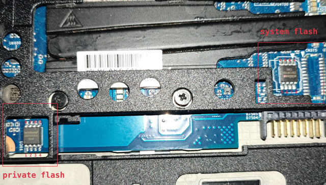

# HP EliteBook 820 G2

This page is about the notebook [HP EliteBook 820 G2].

## Release status

HP EliteBook 820 G2 was released in 2015 and is now end of life.
It can be bought from a secondhand market like Taobao or eBay.

## Required proprietary blobs

The following blobs are required to operate the hardware:

1. EC firmware
2. Intel ME firmware
3. Broadwell mrc.bin and refcode.elf

HP EliteBook 820 G2 uses SMSC MEC1324 as its embedded controller.
The EC firmware is stored in the flash chip, but we don't need to touch it
or use it in the coreboot build process.

Intel ME firmware is in the flash chip. It is not needed when building coreboot.

The Broadwell memory reference code binary and reference code blob is needed
when building coreboot. Read the document [Blobs used in Intel Broadwell boards]
on how to get these blobs.

## Programming

Before flashing, remove the battery and the hard drive cover according to the
[Maintenance and Service Guide] of this laptop.

HP EliteBook 820 G2 has two flash chips, a 16MiB system flash, and a 2MiB
private flash. To install coreboot, we need to program both flash chips.
Read [HP Sure Start] for detailed information.



To access the system flash, we need to connect the AC adapter to the machine,
then clip on the flash chip with an SOIC-8 clip. An [STM32-based flash programmer]
made with an STM32 development board is tested to work.

To access the private flash chip, we can use a ch341a based flash programmer and
flash the chip with the AC adapter disconnected.

To flash coreboot on a board running OME firmware, create a backup for both flash
chips, then do the following:

1. Erase the private flash to disable the IFD protection
2. Modify the IFD to shrink the BIOS region, so that we can put the firmware outside
   the protected flash region

To erase the private flash chip, attach it with the flash programmer via the SOIC-8 clip,
then run:

    flashrom -p <programmer> --erase

To modify the IFD, write the following flash layout to a file:

    00000000:00000fff fd
    00001000:00002fff gbe
    00003000:005fffff me
    00600000:00bfffff bios
    00eb5000:00ffffff pd

Suppose the above layout file is ``layout.txt`` and the origin content of the system flash
is in ``factory-sys.rom``, run:

    ifdtool -n layout.txt factory-sys.rom

Then a flash image with a new IFD will be in ``factory-sys.rom.new``.

Flash the IFD of the system flash:

    flashrom -p <programmer> --ifd -i fd -w factory-sys.rom.new

Then flash the coreboot image:

    # first extend the 12M coreboot.rom to 16M
    fallocate -l 16M build/coreboot.rom
    flashrom -p <programmer> --ifd -i bios -w build/coreboot.rom

After coreboot is installed, the coreboot firmware can be updated with internal flashing:

    flashrom -p internal --ifd -i bios --noverify-all -w build/coreboot.rom

## Debugging

The board can be debugged with EHCI debug. The EHCI debug port is the USB port on the left.

## Test status

### Untested

- NFC module
- Fingerprint reader
- Smart Card reader

### Working

- mainboards with i3-5010U, i5-5300U CPU, 16G+8G DDR3L memory
- SATA and M.2 SATA disk
- PCIe SSD
- Webcam
- Touch screen
- Audio output from speaker and headphone jack
- Intel GbE (needs a modified refcode documented in [Blobs used in Intel Broadwell boards])
- WLAN
- WWAN
- SD card reader
- Internal LCD, DisplayPort and VGA video outputs
- Dock
- USB
- Keyboard and touchpad
- EC ACPI
- S3 resume
- TPM
- Arch Linux with Linux 5.11.16
- Broadwell MRC version 2.6.0 Build 0 and refcode from Purism Librem 13 v1
- Graphics initialization with libgfxinit
- Payload: SeaBIOS 1.16.2
- EC firmware: KBC Revision 96.54 from OEM firmware version 01.05
- Internal flashing under coreboot

## Technology

```eval_rst
+------------------+-----------------------------+
| SoC              | Intel Broadwell             |
+------------------+-----------------------------+
| EC               | SMSC MEC1324                |
+------------------+-----------------------------+
| Coprocessor      | Intel Management Engine     |
+------------------+-----------------------------+
```

[HP EliteBook 820 G2]: https://support.hp.com/us-en/product/HP-EliteBook-820-G2-Notebook-PC/7343192/
[Blobs used in Intel Broadwell boards]: ../../soc/intel/broadwell/blobs.md
[Maintenance and Service Guide]: http://h10032.www1.hp.com/ctg/Manual/c04775894.pdf
[STM32-based flash programmer]: https://github.com/dword1511/stm32-vserprog
[HP Sure Start]: hp_sure_start.md
