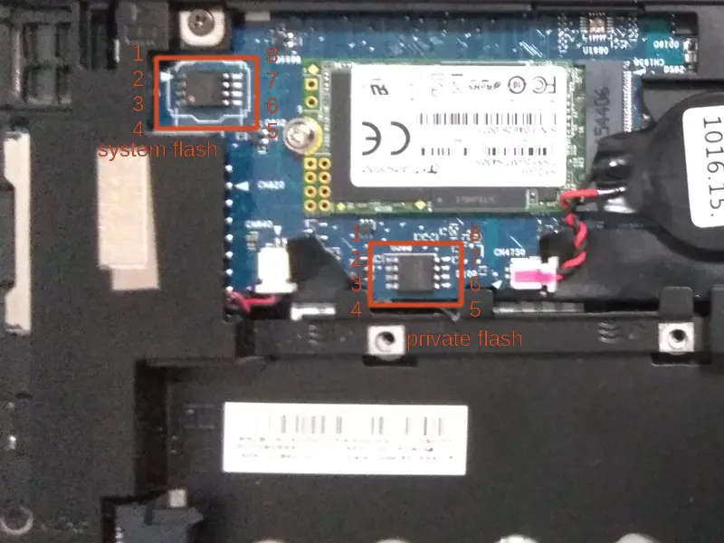

# HP EliteBook Folio 9480m

This page is about the notebook [HP EliteBook Folio 9480m].

## Release status

HP EliteBook Folio 9480m was released in 2014 and is now end of life.
It can be bought from a secondhand market like Taobao or eBay.

## Required proprietary blobs

The following blobs are required to operate the hardware:

1. EC firmware
2. Intel ME firmware
3. mrc.bin

HP EliteBook Folio 9480m uses SMSC MEC1322 as its embedded controller.
The EC firmware is stored in the flash chip, but we don't need to touch it
or use it in the coreboot build process.

Intel ME firmware is in the flash chip. It is not needed when building coreboot.

The Haswell memory reference code binary is needed when building coreboot.
Please see [mrc.bin](../../northbridge/intel/haswell/mrc.bin).

## Programming

Before flashing, remove the battery and the hard drive cover according to the
[Maintenance and Service Guide] of this laptop.



HP EliteBook Folio 9480m has two flash chips, a 16MiB system flash, and a 2MiB
private flash. To install coreboot, we need to program both flash chips.
Read [HP Sure Start] for detailed information.

To access the system flash, we need to connect the AC adapter to the machine,
then clip on the flash chip with an SOIC-8 clip. An [STM32-based flash programmer]
made with an STM32 development board is tested to work.

To access the private flash chip, we can use a ch341a based flash programmer and
flash the chip with the AC adapter disconnected.

Before flashing coreboot, we need to do the following:

1. Erase the private flash to disable the IFD protection
2. Modify the IFD to shrink the BIOS region, so that we'll not use or override
   the protected bootblock and PEI region, as well as the EC firmware

To erase the private flash chip, attach it with the flash programmer via the SOIC-8 clip,
then run:

    flashrom -p <programmer> --erase

To modify the IFD, we need a new flash layout. The flash layout of the OEM firmware is:

    00000000:00000fff fd
    00001000:00002fff gbe
    00003000:005fffff me
    00600000:00ffffff bios

The default coreboot configuration sets the flash chip size to 12MiB, so set the end of the
BIOS region to 0xbfffff in the new layout. The modified IFD is as follows (Platform Data
region pd is the region protected by HP Sure Start):

    00000000:00000fff fd
    00001000:00002fff gbe
    00003000:005fffff me
    00600000:00bfffff bios
    00eb5000:00ffffff pd

Write the above layout in a file, and use ifdtool to modify the IFD of a flash image.
Suppose the above layout file is ``layout.txt`` and the origin content of the system flash
is in ``factory-sys.rom``, run:

    ifdtool -n layout.txt factory-sys.rom

Then a flash image with a new IFD will be in ``factory-sys.rom.new``.

Flash the IFD of the system flash:

    flashrom -p <programmer> --ifd -i fd -w factory-sys.rom.new

Then flash the coreboot image:

    # first extend the 12M coreboot.rom to 16M
    fallocate -l 16M build/coreboot.rom
    flashrom -p <programmer> --ifd -i bios -w build/coreboot.rom

After coreboot is installed, the coreboot firmware can be updated with internal flashing:

    flashrom -p internal --ifd -i bios --noverify-all -w build/coreboot.rom

## Debugging

The board can be debugged with EHCI debug. The EHCI debug port is the USB port on the left.

## Test status

### Known issues

- GRUB payload freezes just like previous EliteBook laptops
- Sometimes the PCIe WLAN module can not be found in the OS after booting to the system
- Sometimes all the USB devices can not be found in the OS after S3 resume

### Untested

- Fingerprint reader
- Smart Card reader

### Working

- i5-4310U CPU with 4G+4G memory
- SATA and M.2 SATA disk
- Ethernet
- WLAN
- WWAN
- SD card reader
- USB
- Keyboard and touchpad
- DisplayPort
- VGA
- Dock
- Audio output from speaker and headphone jack
- Webcam
- TPM
- EC ACPI
- S3 resume
- Arch Linux with Linux 5.8.9
- Memory initialization with mrc.bin version 1.6.1 Build 2
- Graphics initialization with libgfxinit
- Payload: SeaBIOS, edk2
- EC firmware
  - KBC Revision 92.15 from OEM firmware version 01.33
  - KBC Revision 92.17 from OEM firmware version 01.50
- Internal flashing under coreboot

## Technology

```eval_rst
+------------------+-----------------------------+
| CPU              | Intel Haswell-ULT           |
+------------------+-----------------------------+
| PCH              | Intel Lynx Point Low Power  |
+------------------+-----------------------------+
| EC               | SMSC MEC1322                |
+------------------+-----------------------------+
| Coprocessor      | Intel Management Engine     |
+------------------+-----------------------------+
```

[HP EliteBook Folio 9480m]: https://support.hp.com/us-en/product/hp-elitebook-folio-9480m-notebook-pc/7089926
[Maintenance and Service Guide]: http://h10032.www1.hp.com/ctg/Manual/c05228980
[STM32-based flash programmer]: https://github.com/dword1511/stm32-vserprog
[HP Sure Start]: hp_sure_start.md
