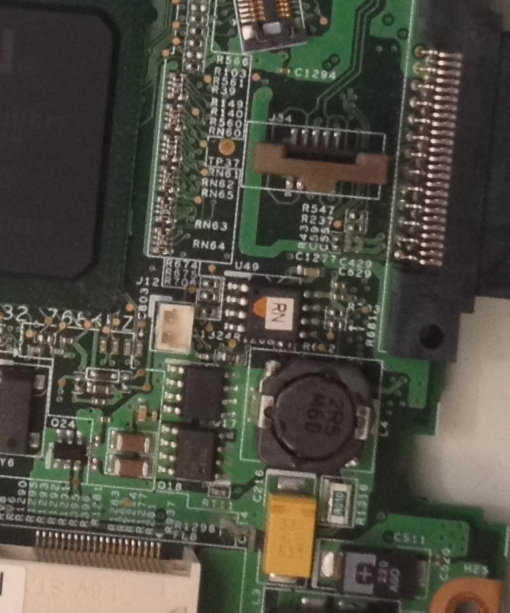

# Lenovo Thinkpad R60

Untested on boards with external Radeon graphics adapter. If you have such
board, proceed at your own risk and document if it does work.

## Flashing instructions

### External flashing

The flash IC is located at the bottom center of the mainboard. Access to
the flash chip is blocked by the magnesium frame, so you need to disassemble
the entire laptop and remove the mainboard. The flash chip is referenced as U49 in
the schematics and in the boardview.

To disassemble the laptop, follow the [Hardware Maintenance Manual](https://thinkpads.com/support/hmm/hmm_pdf/42x3749_02.pdf).

### Internal flashing on Vendor BIOS

This [method](https://gist.github.com/ArthurHeymans/c5ef494ada01af372735f237f6c6adbe) describes a way to install coreboot with vendor firmware still
installed on the Lenovo Thinkpad X60. It is reported to also work in Thinkpad
R60, with the only difference being the board target you build coreboot for.

### Flashing on coreboot

Default configuration of coreboot doesn't feature any flash restrictions
like the vendor firmware, therefore flashrom is able to flash any rom without problems.

## Things tested and working in Linux 5.3:

- Intel WiFi card
- Suspend and resume
- Native graphics initialization. Both legacy VGA and linear framebuffer work
- GRUB2 2.04 and SeaBIOS 1.12.1 payloads
- Reflashing with flashrom (use flashrom-git as of 17.09.2019)
- 2G+1G memory configuration working
- 2504 dock USB ports if not hotplugged

## Things tested and not working:

- 2504 dock hotplugging
- Black bar at the left side of the screen. Doesn't appear in Linux. See picture at top
- Sometimes it takes several second to run coreboot. Just wait for it
