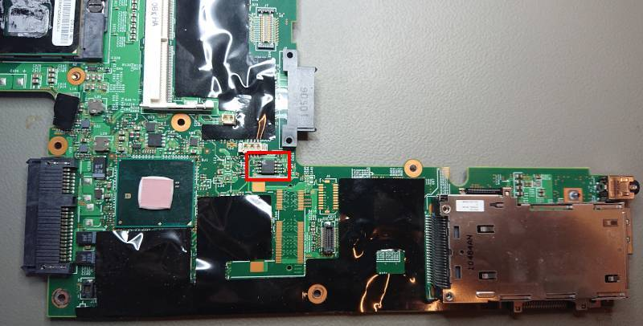

# Lenovo T410

## Known issues
* Dock has wrong ACPI ID (causes "AC adapter state cannot be read" in Linux)
* TPM not working with VBOOT and C_ENV bootblock (works without C_ENV BB)

## Flashing instructions
```eval_rst
+---------------------+--------------------------------+
| Type                | Value                          |
+=====================+================================+
| Socketed flash      | no                             |
+---------------------+--------------------------------+
| Size                | 8 MiB                          |
+---------------------+--------------------------------+
| In circuit flashing | Only in S3/WoL                 |
+---------------------+--------------------------------+
| Package             | SOIC-8                         |
+---------------------+--------------------------------+
| Write protection    | No                             |
+---------------------+--------------------------------+
| Dual BIOS feature   | No                             |
+---------------------+--------------------------------+
| Internal flashing   | Yes                            |
+---------------------+--------------------------------+
```

The flash IC is located at the bottom center of the mainboard.  Sadly,
access to the IC is blocked by the magnesum frame, so you need to disassemble
the entire laptop and remove the mainboard.

Below is a picture of IC on the mainboard, with the pinouts labeled.



The chip will either be a Macronix MX25L6405D or a Winbond W25Q64CVSIG.
Do not rely on dots painted in the corner of the chip (such as the blue dot
pictured) to orient the pins!

[Flashing tutorial](../../tutorial/flashing_firmware/no_ext_power.md)

Steps to access the flash IC are described here [T4xx series].

[T4xx series]: t4xx_series.md
