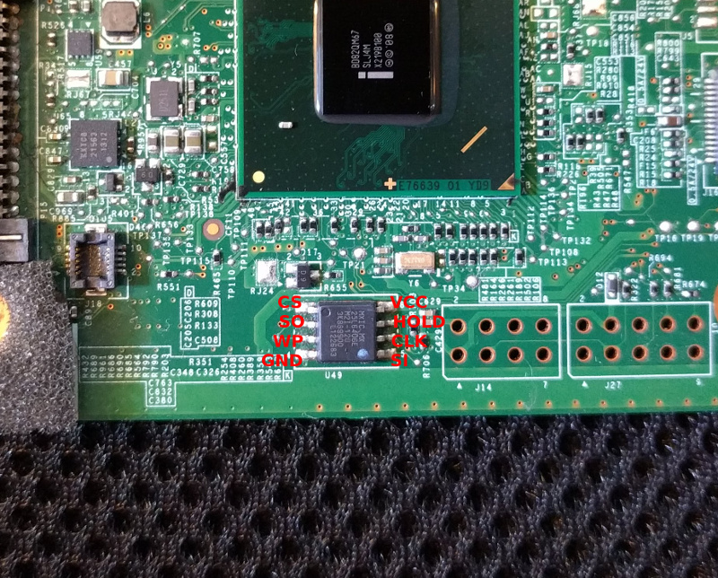

# Lenovo T420

## Flashing instructions
The flash IC is located at the bottom center of the mainboard.  Sadly,
access to the IC is blocked by the magnesum frame, so you need to disassemble
the entire laptop and remove the mainboard.

Below is a picture of IC on the mainboard, with the pinouts labeled.

The chip will either be a Macronix MX25L6404E (shown above) or a Winbond
W25Q64CVSIG.  Do not rely on dots painted in the corner of the chip (such as
the blue dot pictured) to orient the pins!

For more details have a look at [T420 / T520 / X220 / T420s / W520 common] and
the general [flashing tutorial].

Steps to access the flash IC are described here [T4xx series].

## Working
 * CPU: Sandy Bridge i5-2520M, i7-2670QM
 * RAM module combinations of 2G+0, 2G+2G, 4G+0
 * mSATA
 * USB
 * Video (Intel integrated)
 * Sound (integrated speakers, integrated mic, external headphones, external mic)
 * LAN
 * Mini-PCIe slots (WLAN)
 * Bluetooth
 * Linux
 * Windows 10 (through SeaBIOS as payload, using a VGA BIOS)
 * DVD-ROM drive
 * SD card slot
 * TrackPoint
 * Touchpad
 * Webcam
 * Fn hotkeys (backlight control, thinklight)
 * Thinklight
 * Mute button (Speaker only)
 * Mini Jack audio (headphones)
 * Suspend (Linux)

## Not tested
 * DSub (VGA) out
 * DisplayPort out
 * eSATA
 * ExpressCard
 * WWAN

## Not working/TODOs
 * Mutemic button doesn't mute
 * Suspend (Windows 10)

[T4xx series]: t4xx_series.md
[flashing tutorial]: ../../tutorial/flashing_firmware/ext_power.md
[T420 / T520 / X220 / T420s / W520 common]: Sandy_Bridge_series.md
