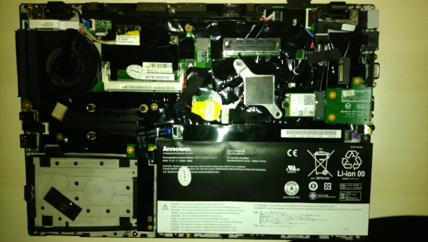
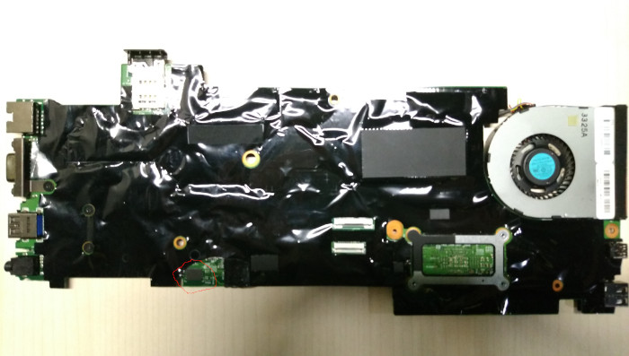
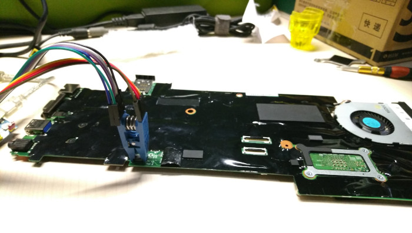

# Lenovo T431s

## Disassembly Instructions

You must remove the following parts before flipping the mainboard
off the main frame:

* Base cover
* Hard disk drive
* Battery pack
* Keyboard

Its [Hardware Maintenance Manual](https://thinkpads.com/support/hmm/hmm_pdf/t431s_hmm_en_0c10894_02.pdf) could be used as a guidance of disassembly.

The WSON-8 flash chip (surrounded with red circle in the photo above)
sits on the opposite side of the mainboard, under a piece of insulating
tape. If solders between the chip and soldering pads fortunately
overflows beside the chip as tiny tin balls attached to soldering pads,
it will be possible to use a pomona 5250 clip to hold the chip, with
its metal tips just attached to tin balls, thus connecting the chip to
the programmer.

The general [flashing tutorial] has more details.

Currently, detecting the model of soldered RAM at runtime and loading
the corresponding SPD datum from CBFS is not implemented yet. You may
have to dump the SPD data when running the vendor firmware with
inteltool, and replace the content of the SPD hex with what is dumped.

(the mechanism may be similar to that on x1_carbon_gen1 and s230u, but
I do not know how to find gpio ports for that, and SPD data stored in
vendor firmware.)

[T420 / T520 / X220 / T420s / W520 common]: Sandy_Bridge_series.md
