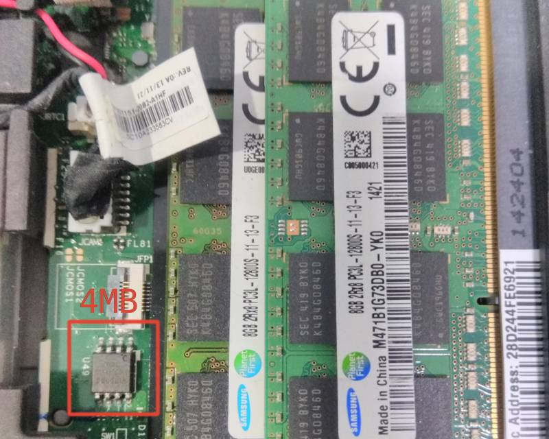
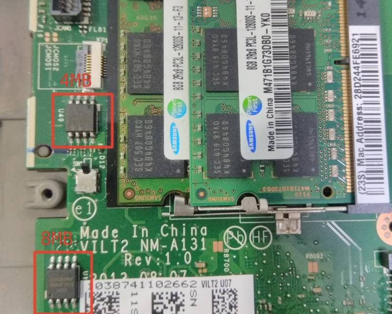

# Lenovo ThinkPad T440p

This page describes how to run coreboot on [Lenovo ThinkPad T440p].

## Required proprietary blobs

Please see [mrc.bin](../../northbridge/intel/haswell/mrc.bin).

## Flashing instructions

T440p has two flash chips, an 8MB W25Q64FV and a 4MB W25Q32FV. To flash
coreboot, you just need to remove the big door according to the T440
[Hardware Maintenance Manual] and flash the 4MB chip.

To access the 8MB chip, you need to remove the base cover.

The flash layout of the OEM firmware is as follows:

    00000000:00000fff fd
    00001000:00002fff gbe
    00003000:004fffff me
    00500000:00bfffff bios

After flashing coreboot, you may need to re-plug the AC adapter to make
the laptop able to power on.

## Known Issues

- Cannot get the mainboard serial number from the mainboard: the OEM
  UEFI firmware gets the serial number from an "emulated EEPROM" via
  I/O port 0x1630/0x1634, but it's still unknown how to make it work
- The dGPU does not currently work in Windows.

## Working

- boot Arch Linux with Linux 4.19.77 from SeaBIOS payload
- integrated graphics init with libgfxinit
- EHCI debug: the port is the non-charging USB2 port on the right
- video output: internal (eDP), miniDP, dock DP, dock HDMI
- ACPI support
- keyboard and trackpoint
- SATA
- M.2 SATA SSD
- USB
- Ethernet
- WLAN
- WWAN
- bluetooth
- virtualization: VT-x and VT-d
- dock
- CMOS options: wlan, trackpoint, fn_ctrl_swap
- internal flashing when IFD is unlocked
- using `me_cleaner`
- dGPU (must be enabled in CMOS options)

[Lenovo ThinkPad T440p]: https://pcsupport.lenovo.com/us/zh/products/laptops-and-netbooks/thinkpad-t-series-laptops/thinkpad-t440p
[Hardware Maintenance Manual]: https://download.lenovo.com/ibmdl/pub/pc/pccbbs/mobiles_pdf/t440p_hmm_en_sp40a25467_04.pdf
