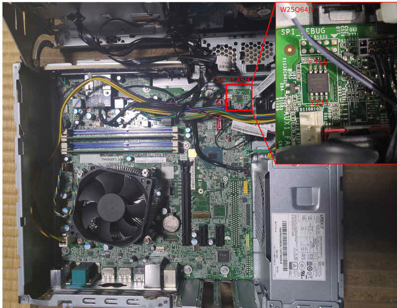

# Lenovo ThinkCentre M710s

This page provides technical documentation on [Lenovo ThinkCentre M710s].

## Flash chip

```{eval-rst}
+----------+-------------+
| Type     | Value       |
+==========+=============+
| Socketed | yes         |
+----------+-------------+
| Model    | W25Q64JV-.Q |
+----------+-------------+
| Size     | 8MiB        |
+----------+-------------+
| Package  | SOIC-8      |
+----------+-------------+
```

The flash chip is divided into the following regions.

	00000000:00000fff fd
	00200000:007fffff bios
	00003000:001fffff me
	00001000:00002fff gbe

## Flashing

The flash chip cannot be flashed internally when running vendor firmware, and must
be flashed externally using a programmer of your choice.

Steps on how to open the chassis and get access to the mainboard are described
in the [hardware maintenance manual]. Follow the steps shown from
"[Removing the computer cover]" until step 1 of "[Replacing the storage drive]".

The SPI flash should be easy to identify and the location is shown in the image
below. See the [datasheet] and [flashing firmware tutorial] for more information.



## Status

### Working
 * Ubuntu 22.04.1 (Linux 6.5.0) using payloads:
   * SeaBIOS
   * MrChromebox's EDK 2 fork
   * Tianocore's EDK 2
 * Internal flashing (from coreboot)
 * PEG (PCIe Graphics)
 * PCIe
 * SATA
 * M.2 SSD
 * M.2 WLAN (+ Bluetooth)
 * LAN
 * USB
 * Memory card reader
 * CPU fan
 * VGA
 * Display ports
 * Audio (output)
 * COM1
 * TPM

### Not working
 * Super I/O not well supported (there may be some minor issues)
 * Power button LED
 * ME cleaner

### Untested
 * Audio (input)
 * COM2 header
 * LPT header
 * PS/2 keyboard and mouse

[Lenovo ThinkCentre M710s]: https://www.lenovo.com/us/en/p/desktops/thinkcentre/m-series-sff/thinkcentre-m710s/11tc1md710s
[hardware maintenance manual]: https://download.lenovo.com/pccbbs/thinkcentre_pdf/m710s_ug_hmm_en.pdf
[Removing the computer cover]: https://download.lenovo.com/pccbbs/thinkcentre_pdf/m710s_ug_hmm_en.pdf#page=28
[Replacing the storage drive]: https://download.lenovo.com/pccbbs/thinkcentre_pdf/m710s_ug_hmm_en.pdf#page=31
[datasheet]: https://www.winbond.com/hq/product/code-storage-flash-memory/serial-nor-flash/?__locale=en&partNo=W25Q64JV
[flashing firmware tutorial]: ../../tutorial/flashing_firmware/index.md
