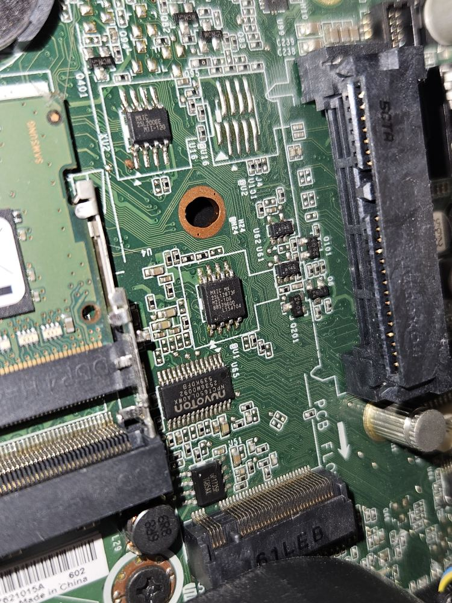

# Lenovo ThinkCentre M700 / M900 Tiny

This page provides technical documentation on [Lenovo ThinkCentre M700 / M900 Tiny].

M700 Tiny and M900 Tiny are twin designs using the same exact mainboard, with
the following differences:

```{eval-rst}
+------------------------+------+------+
|        Feature         | M700 | M900 |
+========================+======+======+
| Chipset                | B150 | Q170 |
+------------------------+------+------+
| Intel AMT              | No   | Yes  |
+------------------------+------+------+
| Intel TXT              | No   | Yes  |
+------------------------+------+------+
| PCIe lanes in M.2 slot | No   | Yes  |
+------------------------+------+------+
```

## Flash chip

```{eval-rst}
+----------+--------------------------+
|   Type   |          Value           |
+==========+==========================+
| Socketed | no                       |
+----------+--------------------------+
| Model    | W25Q128.V or MX25L12873F |
+----------+--------------------------+
| Size     | 16MiB                    |
+----------+--------------------------+
| Package  | SOIC-8                   |
+----------+--------------------------+
```

The flash chip is divided into the following regions.

	00000000:00000fff fd
	00001000:00002fff gbe
	00003000:007fffff me
	00800000:00ffffff bios

## Flashing

The flash chip cannot be flashed internally when running vendor firmware, and must
be flashed externally using a programmer of your choice.

Steps on how to open the chassis and get access to the mainboard are described
in the [hardware maintenance manual]. Follow the steps shown from
"[Removing the computer cover]" until "[Replacing the M.2 storage drive]".

The SPI flash should be easy to identify and the location is shown in the image
below. See the [datasheet] and [flashing firmware tutorial] for more information.



## Status

### Working

 * Debian 12 (Linux 6.1.0) using MrChromebox' EDK II fork (uefipayload_2502)
 * M.2 SATA + NVMe slot
 * M.2 Wi-Fi slot
 * Display ports
 * USB
 * Audio
 * LAN
 * CPU fan
 * Discrete TPM 1.2
 * Internal flashing (from coreboot)
 * COM1 header
 * DisplayPort header
 * Power LED
 * S3 Suspend

### Untested

 * PS/2 header
 * PCIe + SATA "2L" expansion header

[Lenovo ThinkCentre M700 / M900 Tiny]: https://psref.lenovo.com/syspool/Sys/PDF/ThinkCentre/ThinkCentre_M900_Tiny/ThinkCentre_M900_Tiny_Spec.PDF
[hardware maintenance manual]: https://download.lenovo.com/pccbbs/thinkcentre_pdf/m700_m900_m900x_tiny_hmm.pdf
[Removing the computer cover]: https://download.lenovo.com/pccbbs/thinkcentre_pdf/m700_m900_m900x_tiny_hmm.pdf#page=119
[Replacing the M.2 storage drive]: https://download.lenovo.com/pccbbs/thinkcentre_pdf/m700_m900_m900x_tiny_hmm.pdf#page=134
[datasheet]: https://www.mouser.com/datasheet/2/949/w25q128jv_revf_03272018_plus-1489608.pdf
[flashing firmware tutorial]: ../../tutorial/flashing_firmware/index.md
