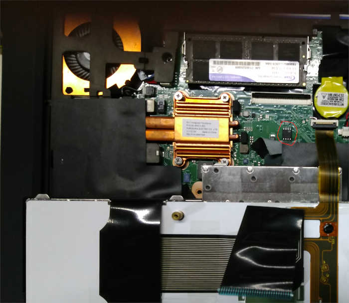

# Lenovo X1

## Flashing instructions

You have to remove the keyboard in order to access the flash IC (the chip
inside the red circle on the picture above), as it is under the wider
cable (already detached from MB in the picture) connecting the keyboard
to the mainboard.

The flash IC can be a SOIC-8 one or a WSON-8 one, and may be covered with
a piece of insulation tape.

For more details have a look at [T420 / T520 / X220 / T420s / W520 common] and
the general [flashing tutorial].

Steps to access the flash IC are described here [X2xx series].

[X2xx series]: x2xx_series.md
[flashing tutorial]: ../../tutorial/flashing_firmware/ext_power.md
[T420 / T520 / X220 / T420s / W520 common]: Sandy_Bridge_series.md
