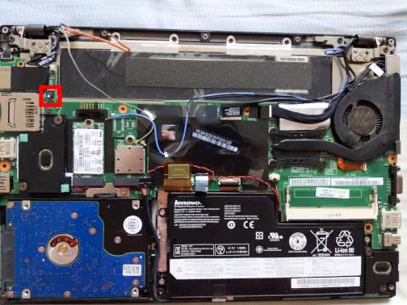

# ThinkPad Lenovo X230s

## Disassembly Instructions

You must remove the following parts to access the SPI flash chip:

* Base cover

The [Hardware Maintenance Manual](https://download.lenovo.com/ibmdl/pub/pc/pccbbs/
mobiles_pdf/x230s_hmm_en_0c10860_01.pdf) could be used as a guidance of disassembly.

The SPI flash chip (W25Q128.V in the form of SOIC-8 for the author's X230s, but varying is possible)
is located at the circled place.

Unlike [most Ivy Bridge ThinkPads](Ivy_Bridge_series.md), X230s has a single 16MiB SPI flash chip.

The general [flashing tutorial](../../tutorial/flashing_firmware/index.md) has more details.
