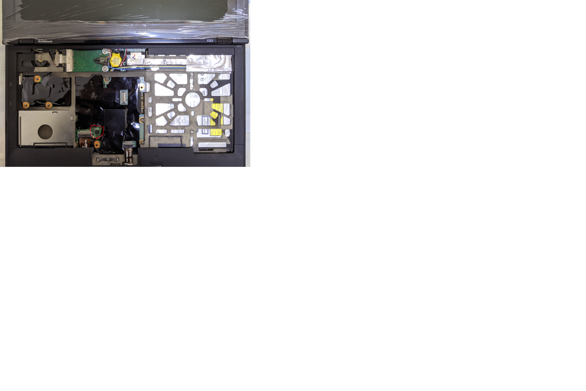

# Lenovo X301

## Disassembly Instructions

You must remove the following parts to access the SPI flash:

* Battery pack
* Keyboard

Its [Hardware Maintenance Manual](https://download.lenovo.com/ibmdl/pub/pc/pccbbs/mobiles_pdf/43y9441.pdf) can be used as a guidance of disassembly.

The WSON-8 flash chip (surrounded with red circle in the photo above,
already replaced with a SOIC-8 one) sits under a piece of insulating
tape. If solders between the chip and soldering pads fortunately
overflows beside the chip as tiny tin balls attached to soldering pads,
it will be possible to use a pomona 5250 clip to hold the chip, with
its metal tips just attached to tin balls, thus connecting the chip to
the programmer. Otherwise, it may be recommended to replace it with a
SOIC-8 one (you might need to add the chip to the IFD VSCC list), as
what is done in the photo.

The vendor IFD VSCC list contains:
- MACRONIX_MX25L6405 (0xc2, 0x2017)
- WINBOND_NEX_W25X64 (0xef, 0x3017)
- ATMEL_AT25DF641 (0x1f, 0x4800)

The general [flashing tutorial] has more details.

Tested:
- Core 2 Duo U9400 CPU
- Slotted DIMM 4GiB*2 from Samsung
- Camera
- PCI-e slots
- SATA and USB2
- libgfxinit-based graphics init
- NVRAM options for North and South bridges
- Sound
- ThinkPad EC
- S3
- Linux 4.19.67-2 within Debian GNU/Linux stable, loaded from
  Linux payload (Heads) and SeaBIOS.

[flashing tutorial]: ../../tutorial/flashing_firmware/ext_power.md

