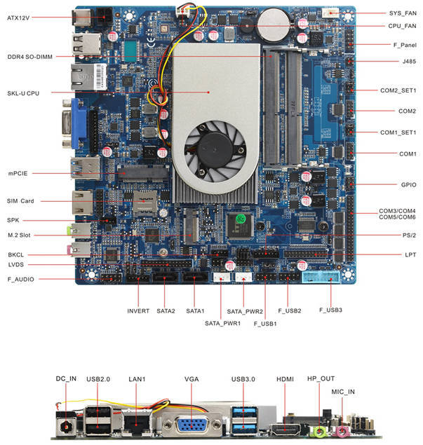

# Libretrend LT1000

This page describes how to run coreboot on the [Libretrend LT1000] (aka
Librebox).



## Required proprietary blobs

To build a minimal working coreboot image some blobs are required (assuming
only the BIOS region is being modified).

```{eval-rst}
+-----------------+---------------------------------+---------------------+
| Binary file     | Apply                           | Required / Optional |
+=================+=================================+=====================+
| FSP-M, FSP-S    | Intel Firmware Support Package  | Required            |
+-----------------+---------------------------------+---------------------+
| microcode       | CPU microcode                   | Required            |
+-----------------+---------------------------------+---------------------+
```

FSP-M and FSP-S are obtained after splitting the Kaby Lake FSP binary (done
automatically by coreboot build system and included into the image) from the
*3rdparty/fsp* submodule.

Microcode updates are automatically included into the coreboot image by build
system from the *3rdparty/intel-microcode* submodule.

The mainboard code also contains a VBT file (version 1.00, BDB version 2.09)
which is automatically included into the image by coreboot build system.

## Flashing coreboot

### Internal programming

The main SPI flash can be accessed using [flashrom]. It is strongly advised to
flash only the BIOS region if not having an external programmer, see known
issues.

### External programming

The system has an internal flash chip which is a 8 MiB soldered SOIC-8 chip.
This chip is located on the top middle side of the board near the CPU fan,
between the DIMM slots and the M.2 disk. Use a clip (or solder the wires) to
program the chip. Specifically, it's a Winbond W25Q64FV (3.3V) -
[datasheet][W25Q64FV].

## Known issues

- Fastboot (MRC cache) is not working reliably (missing schematics for CPU to
  DIMM wiring).
- Flashing ME region with already cleaned ME firmware may lead to platform not
  booting, flashing full ME firmware is needed to recover.
- In order to have the USB device wake support from S3 state using the front
  USB 3.0 ports, one has to move the jumper on DUSB1_PWR_SET header (it will
  switch the power rails for the USB 3.0 ports).
- There are 6 unknown GPIO pins on the board.

## Untested

Not all mainboard's peripherals and functions were tested because of lack of
the cables or not being populated on the board case.

- LVDS header
- Onboard USB 2.0 and USB 3.0 headers
- Speakers and mic header
- SPDIF header
- Audio header
- PS/2 header
- LPT header
- CIR (infrared header)
- COM2 port RS485 mode (RS232/RS485 mode is controlled via jumper)
- SYS_FAN header

## Working

- USB
- Ethernet
- Integrated graphics (with libgfxinit) on VGA and HDMI ports
- flashrom
- PCIe
- NVMe
- WiFi and Bluetooth
- SATA
- Serial ports 1-6
- SMBus
- HDA (verbs not implemented yet, but works under GNU/Linux (4.15 tested))
- Initialization with KBL FSP 2.0
- SeaBIOS payload (version rel-1.13.0)
- TPM2 ([custom module] connected to LPC DEBUG header)
- Automatic fan control
- Platform boots with cleaned ME (MFS partition must be left on SPI flash)

## Technology

The platform contains an LR-i7S65T1 baseboard (LR-i7S65T2 with two NICs not
sold yet). More details on [baseboard site]. Unfortunately the board manual is
not publicly available.

```{eval-rst}
+------------------+--------------------------------------------------+
| CPU              | Intel Core i7-6500U                              |
+------------------+--------------------------------------------------+
| PCH              | Skylake-U Premium                                |
+------------------+--------------------------------------------------+
| Super I/O        | ITE IT8786E                                      |
+------------------+--------------------------------------------------+
| Coprocessor      | Intel Management Engine                          |
+------------------+--------------------------------------------------+
```

[Libretrend LT1000]: https://libretrend.com/specs/librebox/
[W25Q64FV]: https://www.winbond.com/resource-files/w25q64fv%20revs%2007182017.pdf
[flashrom]: https://flashrom.org/
[baseboard site]: http://www.minicase.net/product_LR-i7S65T1.html
[custom module]: https://shop.3mdeb.com/product/tpm2-module-for-librebox/
