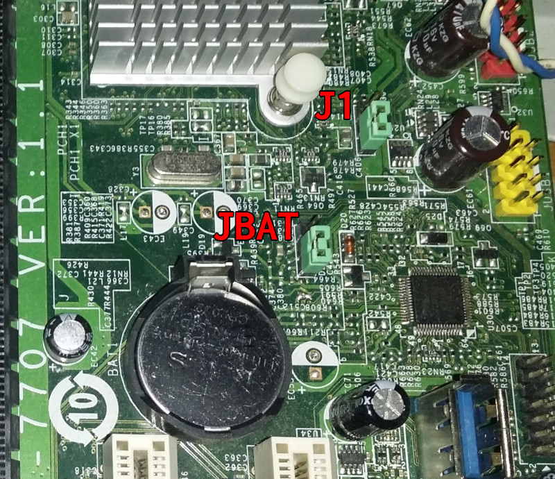
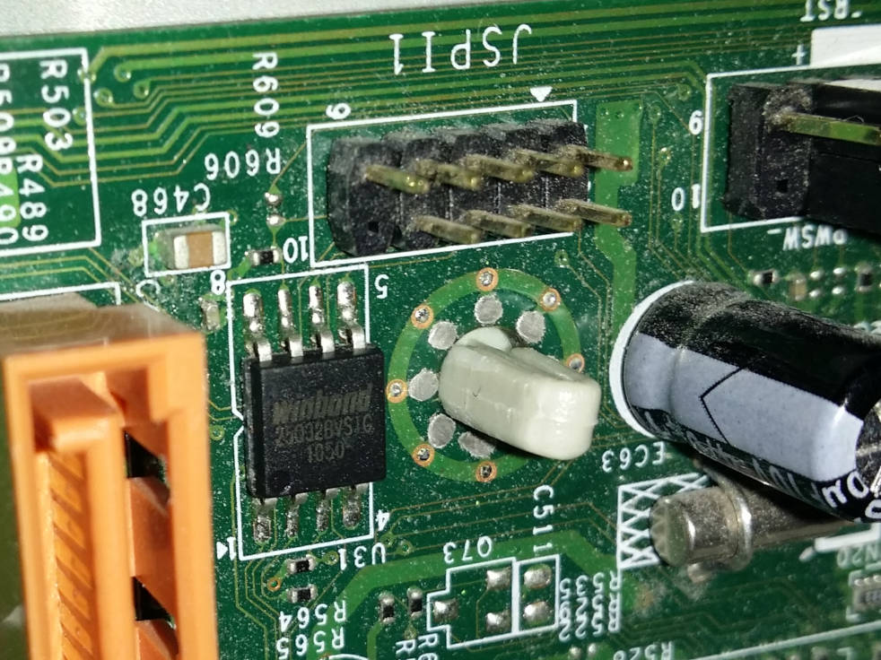
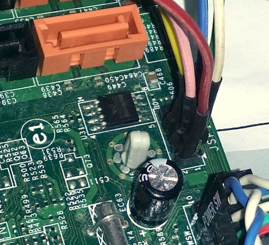
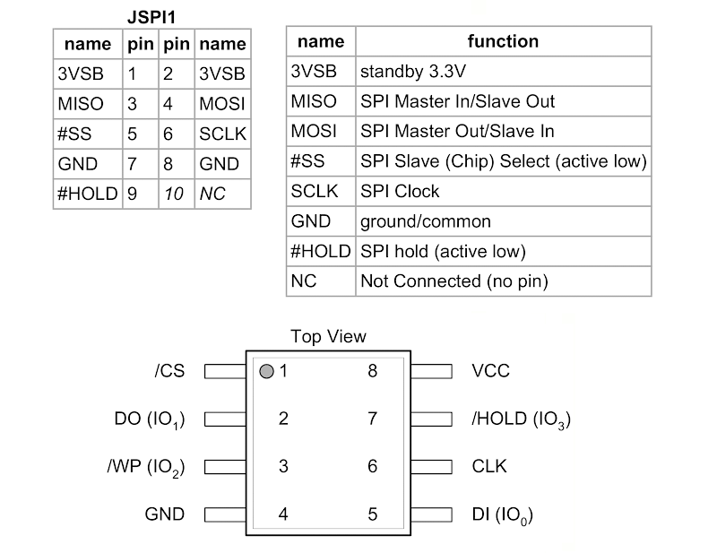

# MSI MS-7707 V1.1

* MSI MS-7707 V1.1 (Medion OEM Akoya P4385D MSN10014555)
* SandyBridge Intel P67 (BD82x6x)
* Winbond 25Q32BV (4 MiB)
* Fintek F71808A SuperIO
* Intel 82579V Gigabit
* NEC uPD720200 USB 3.0 Host Controller
* IME 7.0.4.1197

## Flash chip (Winbond 25Q32BV)
```eval_rst
+---------------------+--------------------+
| Type                | Value              |
+=====================+====================+
| Size                | 4 MiB              |
+---------------------+--------------------+
| BIOS range          | 2 MiB              |
+---------------------+--------------------+
| Write protection    | Yes (via jumper)   |
+---------------------+--------------------+
| Header              | Yes (JSPI1)        |
+---------------------+--------------------+
| Package             | SOIC-8             |
+---------------------+--------------------+
| In circuit flashing | Yes                |
+---------------------+--------------------+
| Internal flashing   | Yes                |
+---------------------+--------------------+
| Socketed flash      | No                 |
+---------------------+--------------------+
| Dual BIOS feature   | No                 |
+---------------------+--------------------+
| ME removable        | Yes                |
+---------------------+--------------------+
```

## Installation instructions
* The standard method is to only flash the 2MiB BIOS region. In that case it's
not needed to extract blobs from vendor firmware and internal flashing is
sufficient.
* To flash the whole chip (e.g. to disable ME) blobs are needed to build
coreboot. Blobs can be extracted with util/ifdtool from 4MiB full dump image
(see below). Its recommended to include the VGA BIOS as well (4MiB write only).
Kconfig is prepared already if it gets enabled (path and 8086,0102).
```
coreboot/3rdparty/blobs/mainboard/msi/ms7707
├── descriptor.bin
├── gbe.bin
├── me.bin
└── vgabios.bin
```
* Never write a full 4MiB image if blobs are not included. The generated
coreboot.rom file is always 4MiB but the 2MiB flash command below will only
flash the last 2MiB (BIOS) block.
* The J1-Jumper sets the 'Flash Descriptor Override Strap-Pin' and enables
full 4MiB access for internal flasher (read and write).
* **Write BIOS-range** (2MiB) with J1-Jumper=off (as on picture/default
	position):
```
flashrom -p internal:ich_spi_force=yes --noverify-all --ifd -i bios -w coreboot.rom
```
* **Read full dump** (4MiB) with J1-jumper=on:
```
flashrom -p internal -r original.rom
```
* **Write full dump** (4MiB) with J1-Jumper=on:
```
flashrom -p internal -w coreboot.rom
```
* After successful flashing turn main power off, wait some seconds to drain
the capacitors, pull the battery and set the JBAT (clrcmos) jumper for some
seconds. Setting the jumper alone is not enough (the Fintek is VBAT backed).
Put all back in place and restart the board. It might need 1-2 AC power cycles
to reinitialize (running at full fan speed - don't panic).
* External flashing has been tested with RPi2 without main power connected.
3.3V provided by RPi2. Read more about [flashing methods].
* In case of going back to proprietary BIOS create/save CMOS settings as early
as possible (do not leave BIOS on first start without saving settings).
The BIOS might corrupt nvram (not cmos!) and leave the system in a dead state
that needs an external flasher to revive. If stuck, reset the Fintek (see
above) and restart the system several times and/or try setting J1 to
temporarily disable ME.



* The JSPI1 header (5×2 2.0mm pitch pin header) for external flashing is
directly connected to the flash chip. Additional 3.3V to /HOLD and /WP is not
needed (internally re-routed already).







## Flash layout

* The 4MiB flashrom is divided into 4 sections:

![][flashlayout]

## Links

- [BIOS ROM]
- [Fintek F71808A datasheet]
- [Winbond 25Q32BV datasheet]

[BIOS ROM]: https://www.medion.com/de/servicebackend/_lightbox/treiber_details.php?did=9744
[Winbond 25Q32BV datasheet]: https://www.winbond.com/resource-files/w25q32bv_revi_100413_wo_automotive.pdf
[Fintek F71808A datasheet]: https://www.alldatasheet.com/datasheet-pdf/pdf/459069/FINTEK/F71808A.html
[flashlayout]: flashlayout.svg
[flashing methods]: ../../../tutorial/flashing_firmware/index.md
