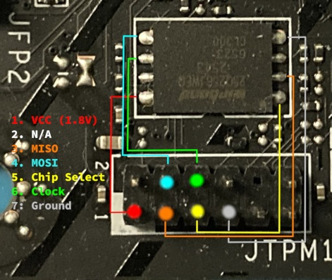

# MSI MS-7D98

This page describes how to run coreboot on the [MSI MS-7D98].

## Model naming scheme, memory types

This port was developed and tested on an `MSI PRO B760-P WIFI DDR4`.
However, maintainer of this board belives it also covers other MS-7D98 models.

While only DDR4 memory's been tested at this moment, adding support for DDR5 models should
be trivial.
Most likely the only required change is changing `MEM_TYPE_DDR4` to
`MEM_TYPE_DDR5` in `romstage_fsp_params.c`

```{eval-rst}
+------------------------+-------------+---------------------------------+
| Marketing name         | Memory type | Status                          |
+========================+=============+=================================+
| PRO B760-P WIFI        | DDR4        | Supported, fully functional     |
+------------------------+-------------+---------------------------------+
| B760 GAMING PLUS WIFI  | DDR4        | Untested, likely functional     |
+------------------------+-------------+---------------------------------+
| PRO B760-P WIFI        | DDR5        | Untested, currently unsupported |
+------------------------+-------------+---------------------------------+
| B760 GAMING PLUS WIFI  | DDR5        | Untested, currently unsupported |
+------------------------+-------------+---------------------------------+
| PRO B760-VC WIFI       | DDR5        | Untested, currently unsupported |
+------------------------+-------------+---------------------------------+
```

## Required proprietary blobs

To build full working image of coreboot, the following blobs are required:

```{eval-rst}
+-----------------+---------------------------------+------------------------+
| Binary file     | Apply                           | Required / Optional    |
+=================+=================================+========================+
| FSP-M & FSP-S   | Intel Firmware Support Package  | Required               |
+-----------------+---------------------------------+------------------------+
| Microcode       | CPU Microcode Update            | Optional (recommended) |
+-----------------+---------------------------------+------------------------+
| ME              | Intel Management Engine         | Optional               |
+-----------------+---------------------------------+------------------------+
| FD              | Intel Flash Descriptor          | Optional               |
+-----------------+---------------------------------+------------------------+
| VBT             | Intel Video Bios Tables         | Optional (iGPU)        |
+-----------------+---------------------------------+------------------------+
| Gen5.bin        | Synopsys PCIe Gen5 firmware     | Required (if ME off)   |
+-----------------+---------------------------------+------------------------+
```

RaptorLake-S FSP (pulled automatically from `3rdparty/fsp` submodule) works perfectly with
all CPU families (AlderLake, RaptorLake) supported by LGA1700 socket.

Including microcode updates is highly recommended for RaptorLake (13/14th Gen) CPUs,
as microcodes released before August 2024 will cause silicon degradation over time
(first fixed version: `0x129`).

Vendor of this board provides full UEFI firmware images available to download for
respective models, which include IFD and ME regions.

It's highly recommended to update them while flashing coreboot, especially if you've
decided to disable ME by setting HAP bit within IFD.

If you've decided to disable Management Engine by setting HAP (High-Assurance Profile) bit
within the Flash Descriptor, you need to:
1. Open stock firmware in tool such as [UEFITool] and extract the file called:
`CPD_partition_Code_gen5.bin`.
2. Include it in your build:
`Chipset -> Include PCIe 5.0 HSPHY firmware in flash`.

This file contains firmware for Synopsys PCIe 5.0. If this file is missing and HAP bit is
set, `PCIE_E1` slot will not work.

## Flashing coreboot

It's impossible to flash coreboot internally due to flash protection being active,
first flash has to be done with an external programmer.

TPM header (`JTPM1`) can be re-purposed to create a flashing cable which will leave no
marks on the board, leaving warranty intact. Be aware that the header uses 2.0mm pitch
(as opposed to "regular" 2.5mm pitch in standard dupont wires).



SPI chip is a `Winbond 25Q256JWFQ` and uses 1.8V logic.

Please make sure to use a 1.8V-capable flasher
(such as `Glasgow Interface Explorer` or `Tigard`) or level-shifter with 3.3V flasher
(such as `CH347`).

If you've decided to flash coreboot without touching HAP bit, IFD or ME, it can be done
with the following command:

`flashprog -p [programmer] --ifd -i BIOS -w build/coreboot.rom`

However, if you're updating your IFD and ME regions, the entire SPI flash
needs to be overwritten:

`flashprog -p [programmer] -w build/coreboot.rom`

For debugging purposes, standard RS232 header (`JCOM1`) is available.

## Tested and working

- All PCIe/M.2 ports
- All RAM slots
- All SATA ports (4x SATA, AHCI drives in M2_2 socket under PCH)
- All USB ports
- Both iGPU outputs, as well as 3D acceleration in OS
- Built-in audio (ALC897), including jack detection
- Built-in CNVi AX211 WiFi/BT
- Built-in RGB controller ("MSI MYSTIC LIGHT", using OpenRGB in Linux)
- Built-in Realtek RTL8125 2.5GbE LAN
- Disabling Management Engine by setting HAP bit in IFD
- DRAM_LED during memory training (romstage) for easier debugging
- SuperIO (RS232, PS/2, FAN control, Voltage/Temperature reporting)
- PC Speaker (goes beep-boop)
- OS: Gentoo Linux (kernel 7.2.9), Windows (10/11)
- Payloads: EDK2, LinuxBoot
- IOMMU/VT-x (PCIe passthrough)
- PCIe ReBAR (Resizable BAR)
- Power on/off, suspend/resume (S3), hibernate

## Notes

1. Payload and pre-OS display output:

    If you are using an external graphics card (AMD, Nvidia, Intel Arc),
    you will see output in your OS as soon as kernel initializes the
    card (called "modesetting" in Linux) regardless of payload you chose.

    If you're planning to primarly use an external card and require a video output during
    firmware phase, you must use EDK2 payload and include the `PciPlatformDxe` driver
    (which loads GOP drivers from PCIe devices) by enabling:
    `Payload -> Load and Execute OpROMs on PCIe devices`

    Please note that if you are using an Intel Alchemist or Battlemage card, enabling:
    `Devices -> Extend resource window for PCIe devices above 4G` is **mandatory**.

2. Power management:
    According to reverse-engineering done by creator of the port, ASPM on this board
    doesn't work (even on stock firmware), as (almost) all PCIe slots
    share a single reset line.
    PCH RootPort 5 (PCIE_E3) is an exception to this rule, where vendor had to implement
    proper power management to sell expensive Thunderbolt 4 cards of dubious usefulness.

3. Unimplemented functionality:
    - Thunderbolt card is expensive and unlikely to be paired with budget board (untested)
    - Some SuperIO sensors don't report values (CPU 1P8, CPU VDDP, AVSB, VBat)

## Specification

```{eval-rst}
+------------------+------------------------------+
| CPU socket       | Intel LGA1700 (ADL/RPL)      |
+------------------+------------------------------+
| PCH              | Intel B760                   |
+------------------+------------------------------+
| Super I/O        | Nuvoton NCT6687D             |
+------------------+------------------------------+
| SPI              | Winbond 25Q256JW 32MiB 1.8V  |
+------------------+------------------------------+
| NIC              | Realtek RTL8125              |
+------------------+------------------------------+
| Audio            | Realtek ALC897               |
+------------------+------------------------------+
```

[MSI MS-7D98]: https://www.msi.com/Motherboard/PRO-B760-P-WIFI-DDR4
[UEFITool]: https://github.com/LongSoft/UEFITool
[flashrom]: https://flashrom.org/
[flashprog]: https://flashprog.org/wiki/Flashprog
