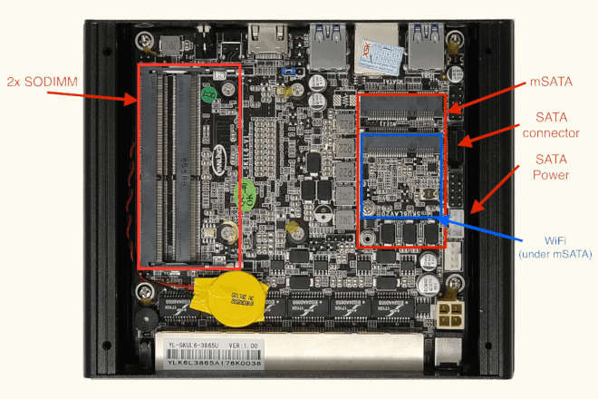

# Protectli Vault FW6 series

This page describes how to run coreboot on the [Protectli FW6].



## Stock firmware

The stock firmware contains only the firmware descriptor, BIOS and
Management Engine. The EC firmware is not present on the SPI chip.

Using ifdtool, a full layout can be obtained along with the ME and FD
flash regions.

## Required proprietary blobs

To build a minimal working coreboot image some blobs are required (assuming
only the BIOS region is being modified).

```{eval-rst}
+-----------------+---------------------------------+---------------------+
| Binary file     | Apply                           | Required / Optional |
+=================+=================================+=====================+
| FSP-M, FSP-S    | Intel Firmware Support Package  | Required            |
+-----------------+---------------------------------+---------------------+
| microcode       | CPU microcode                   | Required            |
+-----------------+---------------------------------+---------------------+
| vgabios         | VGA Option ROM                  | Optional            |
+-----------------+---------------------------------+---------------------+
```

FSP-M and FSP-S are obtained after splitting the Kaby Lake FSP binary (done
automatically by the coreboot build system and included into the image) from
the `3rdparty/fsp` submodule.

Microcode updates are automatically included into the coreboot image by build
system from the `3rdparty/intel-microcode` submodule.

VGA Option ROM is not required to boot, but if one needs graphics in pre-OS
stage, it should be included (if not using libgfxinit).

## Flashing coreboot

### Internal programming

The main SPI flash can be accessed using [flashrom]. The first version
supporting the chipset is flashrom v1.1. Firmware an be easily flashed
with internal programmer (either BIOS region or full image).

The stock firmware can be dumped using [flashrom] or downloaded from
Protectli's official [website].

### External programming

The system has an internal flash chip which is a 8 MiB soldered SOIC-8 chip.
This chip is located on the bottom side of the case (the radiator side). One
has to remove all screws (in order): 4 top cover screws, 4 side cover screws
(one side is enough), 4 mainboard screws, 4 CPU screws (under DIMMs). Lift up
the mainboard and turn around it. The flash chip is near the SoC on the DIMM
slots side. Desolder and reprogram the chip, or use a clip (or solder the
wires) to program the chip. Specifically, it's a Macronix MX25L6406E (3.3V)
-[datasheet][MX25L6406E], while on some other boards it's a Macronix MX25L6436F.

At least on some revisions of the motherboard, it's not possible to reprogram
the chip with a clip, while the board is powered off, because there's no diode
to prevent backfeeding power to other components on the board.

## Known issues

- After flashing with external programmer it is always required to reset RTC
  with jumper or disconnect coin cell temporarily. Only then the platform will
  boot after flashing.
- FW6A does not always work reliably with all DIMMs. Linux happens to hang or
  gives many panics. This issue was present also with vendor BIOS.
- Sometimes FSPMemoryInit return errors or hangs (especially with 2 DIMMs
  connected). A workaround is to power cycle the board (even a few times) or
  temporarily disconnect DIMM when platform is powered off.
- When using libgfxinit and SeaBIOS bootsplash, the red color is dim.

## Untested

Not all mainboard's peripherals and functions were tested because of lack of
the cables or not being populated on the board case.

- Internal USB 2.0 headers

## Working

- USB 3.0 front ports (SeaBIOS and Linux)
- 6 Ethernet ports
- HDMI port with libgfxinit and VGA Option ROM
- flashrom
- PCIe WiFi
- SATA and mSATA
- Super I/O serial port 0 (RS232 via front RJ45 connector)
- SMBus (reading SPD from DIMMs)
- Initialization with KBL FSP 2.0 (with MemoryInit issues)
- SeaBIOS payload (version rel-1.12.1)
- Mini PCIe debug card connected to mSATA (mSATA slot has LPC signals routed)
- Reset switch
- Booting Debian, Ubuntu, FreeBSD, Proxmox
- PCIe passthrough for NICs and iGPU
- Boot with cleaned ME

## Technology

There are 5 variants of FW6 boards: FW6A, FW6B, FW6C, FW6D and FW6E. They differ
in used SoC.

There are two revisions of the motherboard, hereby called Old Revision
(using IT8772E Super I/O chip), and New Revision (using IT8613E Super I/O chip).
Besides the different Super I/O chip, they also differ in component placement,
and available internal motherboard headers. The Old Revision motherboards are
marked with silkscreen "YL-SK1L6-V1", while the New Revision motherboards are
marked with silkscreen "KBR6LAV20".

WARNING: The current code base only supports the Old Revision motherboards.

To compare the two motherboard
revisions one may compare the [New Revision FW6A Datasheet] to the
[Old Revision FW6 Series Hardware Overview].

The FW6A/FW6B/FW6C variants are known to have been produced with both
motherboard revisions.

The FW6D/FW6E variants are only known to exist with the new motherboard revision.

- FW6A:

```{eval-rst}
+------------------+--------------------------------------------------+
| CPU              | Intel Celeron 3865U                              |
+------------------+--------------------------------------------------+
| PCH              | Kaby Lake U w/ iHDCP2.2 Base                     |
+------------------+--------------------------------------------------+
| Super I/O, EC    | Old revision: ITE IT8772E, New rev.: ITE IT8613E |
+------------------+--------------------------------------------------+
| Coprocessor      | Intel Management Engine                          |
+------------------+--------------------------------------------------+
| Support          | Currently only the Old Revision is supported     |
+------------------+--------------------------------------------------+
```

- FW6B:

```{eval-rst}
+------------------+--------------------------------------------------+
| CPU              | Intel Core i3-7100U                              |
+------------------+--------------------------------------------------+
| PCH              | Kaby Lake U w/ iHDCP2.2 Premium                  |
+------------------+--------------------------------------------------+
| Super I/O, EC    | Old revision: ITE IT8772E, New rev.: ITE IT8613E |
+------------------+--------------------------------------------------+
| Coprocessor      | Intel Management Engine                          |
+------------------+--------------------------------------------------+
| Support          | Currently only the Old Revision is supported     |
+------------------+--------------------------------------------------+
```

- FW6C:

```{eval-rst}
+------------------+--------------------------------------------------+
| CPU              | Intel Core i5-7200U                              |
+------------------+--------------------------------------------------+
| PCH              | Kaby Lake U w/ iHDCP2.2 Premium                  |
+------------------+--------------------------------------------------+
| Super I/O, EC    | Old revision: ITE IT8772E, New rev.: ITE IT8613E |
+------------------+--------------------------------------------------+
| Coprocessor      | Intel Management Engine                          |
+------------------+--------------------------------------------------+
| Support          | Currently only the Old Revision is supported     |
+------------------+--------------------------------------------------+
```

- FW6D:

```{eval-rst}
+------------------+--------------------------------------------------+
| CPU              | Intel Core i5-8250U                              |
+------------------+--------------------------------------------------+
| PCH              | Kaby Lake U w/ iHDCP2.2 Premium                  |
+------------------+--------------------------------------------------+
| Super I/O, EC    | ITE IT8613E                                      |
+------------------+--------------------------------------------------+
| Coprocessor      | Intel Management Engine                          |
+------------------+--------------------------------------------------+
| Support          | Currently not supported                          |
+------------------+--------------------------------------------------+
```

- FW6E:

```{eval-rst}
+------------------+--------------------------------------------------+
| CPU              | Intel Core i7-8550U                              |
+------------------+--------------------------------------------------+
| PCH              | Kaby Lake U w/ iHDCP2.2 Premium                  |
+------------------+--------------------------------------------------+
| Super I/O, EC    | ITE IT8613E                                      |
+------------------+--------------------------------------------------+
| Coprocessor      | Intel Management Engine                          |
+------------------+--------------------------------------------------+
| Support          | Currently not supported                          |
+------------------+--------------------------------------------------+
```

## Other compatible boards

As Protectli licenses and uses [Yanling] appliances with no modifications
to the actual hardware, any compatible [Yanling] appliances would work.
Specifically, look for hardware with the same CPU, NIC, and Super I/O chip
and coreboot should be able to compile and boot with no modifications
required.

[Protectli FW6]: https://protectli.com/vault-6-port/
[website]: https://protectli.com/kb/coreboot-on-the-vault/
[MX25L6406E]: https://www.macronix.com/Lists/Datasheet/Attachments/7370/MX25L6406E,%203V,%2064Mb,%20v1.9.pdf
[flashrom]: https://flashrom.org/
[Yanling]: http://www.ylgkdn.cn/
[New Revision FW6A Datasheet]: https://kb.protectli.com/wp-content/uploads/sites/9/2025/04/FW6A-Datasheet-20250204.pdf
[Old Revision FW6 Series Hardware Overview]: https://kb.protectli.com/kb/fw6-hardware-overview/
