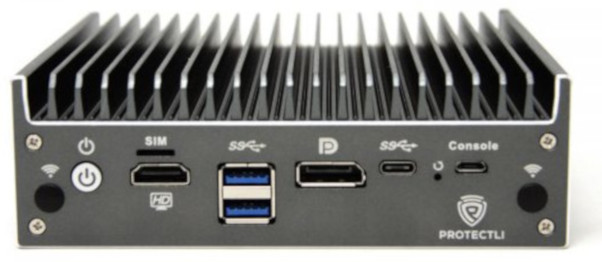
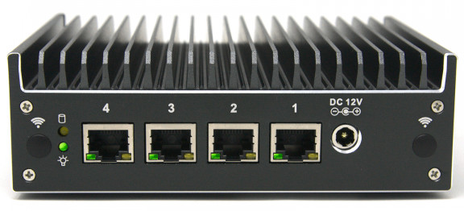
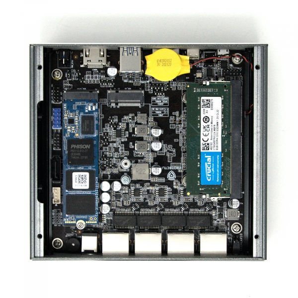

# Protectli Vault VP2420

This page describes how to run coreboot on the [Protectli VP2420].




## Required proprietary blobs

To build a minimal working coreboot image some blobs are required (assuming
only the BIOS region is being modified).

```{eval-rst}
+-----------------+---------------------------------+---------------------+
| Binary file     | Apply                           | Required / Optional |
+=================+=================================+=====================+
| FSP-M, FSP-S    | Intel Firmware Support Package  | Required            |
+-----------------+---------------------------------+---------------------+
| microcode       | CPU microcode                   | Required            |
+-----------------+---------------------------------+---------------------+
```

FSP-M and FSP-S are obtained after splitting the Elkhart Lake FSP binary (done
automatically by the coreboot build system and included into the image) from
the `3rdparty/fsp` submodule.

Microcode updates are automatically included into the coreboot image by build
system from the `3rdparty/intel-microcode` submodule.

## Flashing coreboot

### Internal programming

The main SPI flash can be accessed using [flashrom]. Firmware can be easily
flashed with internal programmer (either BIOS region or full image).

### External programming

The system has an internal flash chip which is a 16 MiB soldered SOIC-8 chip.
This chip is located on the top side of the case (the lid side). One has to
remove 4 top cover screws and lift up the lid. The flash chip is soldered in
under RAM, easily accessed after taking out the memory. Specifically, it's a
KH25L12835F (3.3V) which is a clone of Macronix
MX25L12835F - [datasheet][MX25L12835F].



## Working

- USB 3.0 front ports (SeaBIOS, Tianocore UEFIPayload and Linux)
- 4 Ethernet ports
- HDMI, DisplayPort
- flashrom
- M.2 WiFi
- M.2 4G LTE
- M.2 SATA and NVMe
- 2.5'' SATA SSD
- eMMC
- Super I/O serial port 0 via front microUSB connector
- SMBus (reading SPD from DIMMs)
- Initialization with Elkhart Lake FSP 2.0
- SeaBIOS payload (version rel-1.16.0)
- TianoCore UEFIPayload
- Reset switch
- Booting Debian, Ubuntu, FreeBSD

## Technology

```{eval-rst}
+------------------+--------------------------------------------------+
| CPU              | Intel Celeron J6412                              |
+------------------+--------------------------------------------------+
| PCH              | Intel Elkhart Lake                               |
+------------------+--------------------------------------------------+
| Super I/O, EC    | ITE IT8613E                                      |
+------------------+--------------------------------------------------+
| Coprocessor      | Intel Management Engine                          |
+------------------+--------------------------------------------------+
```

## Useful links

- [VP2420 Hardware Overview](https://protectli.com/kb/vp2400-series-hardware-overview/)
- [VP2420 Product Page](https://protectli.com/product/vp2420/)
- [Protectli TPM module](https://protectli.com/product/tpm-module/)
- [MX25L12835F](https://www.mxic.com.tw/Lists/Datasheet/Attachments/8653/MX25L12835F,%203V,%20128Mb,%20v1.6.pdf)
- [flashrom](https://flashrom.org/)
