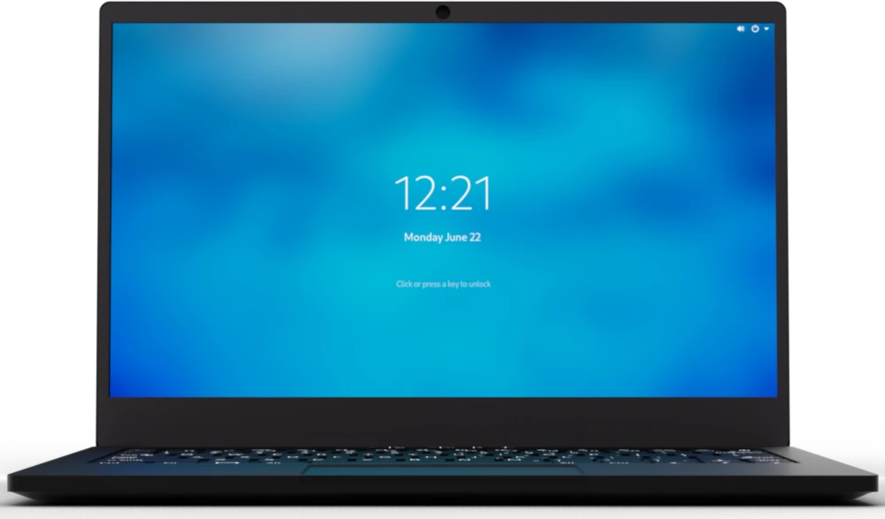
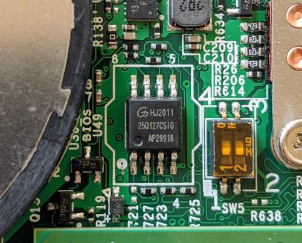
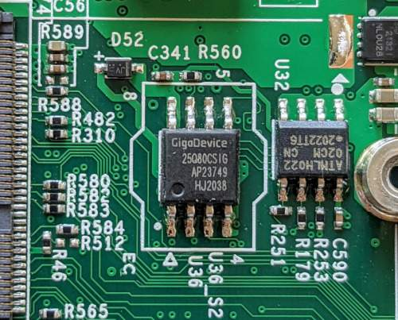

# Purism Librem 14

This page describes how to run coreboot on the [Purism Librem 14].

```eval_rst
+------------------+------------------------------------------------------+
| CPU              | Intel Core i7-10710U                                 |
+------------------+------------------------------------------------------+
| PCH              | Comet Lake LP Premium (Comet Lake-U)                 |
+------------------+------------------------------------------------------+
| EC               | ITE IT8528E                                          |
+------------------+------------------------------------------------------+
| Coprocessor      | Intel Management Engine (CSME 14.x)                  |
+------------------+------------------------------------------------------+
```





## Required proprietary blobs

To build a minimal working coreboot image some blobs are required (assuming
only the BIOS region is being modified).

```eval_rst
+-----------------+---------------------------------+---------------------+
| Binary file     | Apply                           | Required / Optional |
+=================+=================================+=====================+
| FSP-M, FSP-S    | Intel Firmware Support Package  | Required            |
+-----------------+---------------------------------+---------------------+
| microcode       | CPU microcode                   | Required            |
+-----------------+---------------------------------+---------------------+
```

FSP-M and FSP-S are obtained after splitting the CometLake1 FSP binary
(done automatically by the coreboot build system and included into the
image) from the `3rdparty/fsp` submodule.

Microcode updates are automatically included into the coreboot image by the
build system from the `3rdparty/intel-microcode` submodule. Official Purism
release images may include newer microcode, which is instead pulled from
Purism's [purism-blobs] repository.

A VGA Option ROM is not required to boot, as the Librem 14 uses libgfxinit.

## Intel Management Engine

The Librem 14 uses version 14.x of the Intel Management Engine (ME) /
Converged Security Engine (CSE). The ME/CSE is disabled using the High
Assurance Platform (HAP) bit, which puts the ME into a disabled state after
platform bring-up (BUP) and disables all PCI/HECI interfaces.
This can be verified checking the coreboot console log, using coreboot’s
cbmem utility:

    `sudo ./cbmem -1 | grep 'ME:'`

provided coreboot has been patched to output the ME status even when the
PCI device is not visible/active (as it is in Purism's release builds).

## Flashing coreboot

### Internal programming

The main SPI flash can be accessed using [flashrom]. No official flashrom
release supports the CometLake-U SoC yet, so it must be built from source.
Version v1.2-107-gb1f858f or later is needed. Firmware an be easily
flashed with internal programmer (either BIOS region or full image).

### External programming

The system has an internal flash chip which is a 16 MiB soldered SOIC-8
chip, and has a diode attached to the VCC line for in-system programming.
This chip is located on the bottom side of the board, in between the CPU
heatsink and the left cooling fan, just above the left SO-DIMM slot.

One has to remove all 9 screws from the bottom cover, then disconnect the
battery from the mainboard (bottom left of mainboard). Use a SOIC-8 chip
clip to program the chip (a Gigadevice GD25Q127C (3.3V) - [datasheet][GD25Q127C]).

The EC firmware is stored on a separate SOIC-8 chip (a Gigadevices GD25Q80C),
located underneath the Wi-Fi module, below the left cooling fan.

## Known issues

 * Automatic detection of external audio input/output via the 3.5mm jack
   does not currently work.
 * PL1/PL2 limited to 15W/20W by charger and battery discharge capability,
   not SoC or thermal design.

## Working

 * Internal display with libgfxinit, VGA option ROM, or FSP/GOP init
 * External displays via HDMI, USB-C Alt-Mode
 * SeaBIOS (1.14), edk2 (CorebootPayloadPkg), and Heads payloads
 * Ethernet, m.2 2230 Wi-Fi
 * System firmware updates via flashrom
 * M.2 storage (NVMe, SATA III)
 * Built-in audio (speakers, microphone)
 * SMBus (reading SPD from DIMMs)
 * Initialization with FSP 2.0 (CometLake1)
 * S3 Suspend/Resume
 * Booting PureOS 10.x, Debian 11.x, Qubes 4.0.4, Windows 10 20H2

## Not working / untested

 * N/A


[Purism Librem 14]: https://puri.sm/products/librem-14/
[purism-blobs]: https://source.puri.sm/coreboot/purism-blobs
[GD25Q127C]: https://www.gigadevice.com/datasheet/gd25q127c/
[flashrom]: https://flashrom.org/Flashrom
