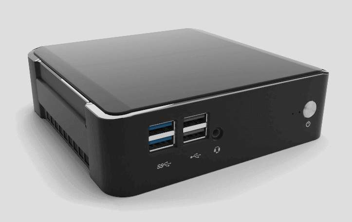
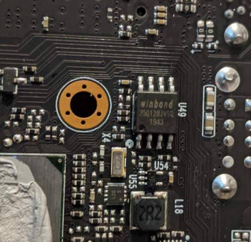

# Purism Librem Mini (v1, v2)

This page describes how to run coreboot on the [Purism Librem Mini].

```eval_rst
+------------------+--------------------------------------------------+
| CPU              | Intel Core i7-8565U/8665U (v1)                   |
|                  | Intel Core i7-10510U      (v2)                   |
+------------------+--------------------------------------------------+
| PCH              | Whiskey Lake / Cannon Point LP       (v1)        |
|                  | Comet Lake LP Premium (Comet Lake-U) (v2)        |
+------------------+--------------------------------------------------+
| Super I/O, EC    | ITE IT8528E                                      |
+------------------+--------------------------------------------------+
| Coprocessor      | Intel Management Engine (CSME 12.x) (v1)         |
|                  | Intel Management Engine (CSME 14.x) (v2)         |
+------------------+--------------------------------------------------+
```




## Required proprietary blobs

To build a minimal working coreboot image some blobs are required (assuming
only the BIOS region is being modified).

```eval_rst
+-----------------+---------------------------------+---------------------+
| Binary file     | Apply                           | Required / Optional |
+=================+=================================+=====================+
| FSP-M, FSP-S    | Intel Firmware Support Package  | Required            |
+-----------------+---------------------------------+---------------------+
| microcode       | CPU microcode                   | Required            |
+-----------------+---------------------------------+---------------------+
| vgabios         | VGA Option ROM                  | Optional            |
+-----------------+---------------------------------+---------------------+
```

FSP-M and FSP-S are obtained after splitting the FSP binary (done automatically
by the coreboot build system and included into the image; Coffee Lake for v1,
Comet Lake for v2) from the `3rdparty/fsp` submodule.

Microcode updates are automatically included into the coreboot image by the build
system from the `3rdparty/intel-microcode` submodule. Official Purism release
images may include newer microcode, which is instead pulled from Purism's
[purism-blobs] repository.

VGA Option ROM is not required to boot, but if one needs graphics in pre-OS
stage, it should be included (if not using FSP/GOP display init). It can
be extracted via cbfstool from the existing board firmware or pulled from
the [purism-blobs] repository.

## Intel Management Engine

The Librem Mini uses version 12.x (v1) or 14.x (v2) of the Intel Management
Engine (ME) / Converged Security Engine (CSE). The ME/CSE is disabled using
the High Assurance Platform (HAP) bit, which puts the ME into a disabled state
after platform bring-up (BUP) and disables all PCI/HECI interfaces.
This can be verified via the coreboot cbmem utility:

    `sudo ./cbmem -1 | grep 'ME:'`

provided coreboot has been modified to output the ME status even when
the PCI device is not visible/active (as it is in Purism's release builds).

## Flashing coreboot

### Internal programming

The main SPI flash can be accessed using [flashrom]. The first version
supporting the chipset is flashrom v1.2 (v1.2-107-gb1f858f or later needed
for the Mini v2). Firmware an be easily flashed with internal programmer
(either BIOS region or full image).

### External programming

The system has an internal flash chip which is a 8 MiB soldered SOIC-8 chip,
and has a diode attached to the VCC line for in-system programming.
This chip is located on the bottom side of the board under the CPU heatsink,
in line with the front USB 2.0 ports.

One has to remove all screws (in order):

 * 2 top cover screws
 * 4 screws securing the mainboard to the chassis
 * 4 screws securing the heatsink/fan assembly to the mainboard (under the SODIMMs)

The m.2 SSD will need to be removed if the Wi-Fi antenna are connected to
an internal Wi-Fi/BT module. Use a SOIC-8 chip clip to program the chip.
Specifically, it's a Winbond W25Q128JV (3.3V) - [datasheet][W25Q128JV].

The EC firmware is stored on a separate SOIC-8 chip (a Winbond W25Q80DV),
but is not protected by a diode and therefore cannot be read/written to without
desoldering it from the mainboard.

## Known issues

 * SeaBIOS can be finicky with detecting USB devices
 * Mode switching with VGA option ROM display init can be slow and sometimes hangs
 * Some SATA devices on the 2.5" interface can have issues operating at 6 Gbps,
   despite the HSIO PHY settings being set optimally via experimentation. These devices
   may show errors in dmesg and drop down to 3 Gbps, but should not fail to boot.
   The same issue is present on the AMI vendor firmware.

## Working

 * External displays via HDMI/DisplayPort with VGA option ROM or FSP/GOP init
   (no libgfxinit support yet)
 * SeaBIOS (1.14), edk2 (CorebootPayloadPkg), Heads (Purism downstream) payloads
 * Ethernet, m.2 2230 Wi-Fi
 * System firmware updates via flashrom
 * PCIe NVMe
 * m.2 and SATA III
 * Audio via front 3.5mm jack, HDMI, and DisplayPort
 * SMBus (reading SPD from DIMMs)
 * Initialization with FSP 2.0 (CFL for v1, CML for v2)
 * S3 Suspend/Resume
 * Booting PureOS 10.x, Debian 11.x, Qubes 4.1.0-alpha1, Linux Mint 20, Windows 10 2004

## Not working / untested

 * ITE IT8528E Super IO functions


[Purism Librem Mini]: https://puri.sm/products/librem-mini/
[purism-blobs]: https://source.puri.sm/coreboot/purism-blobs
[W25Q128JV]: https://www.winbond.com/resource-files/w25q128jv%20revf%2003272018%20plus.pdf
[flashrom]: https://flashrom.org/Flashrom
