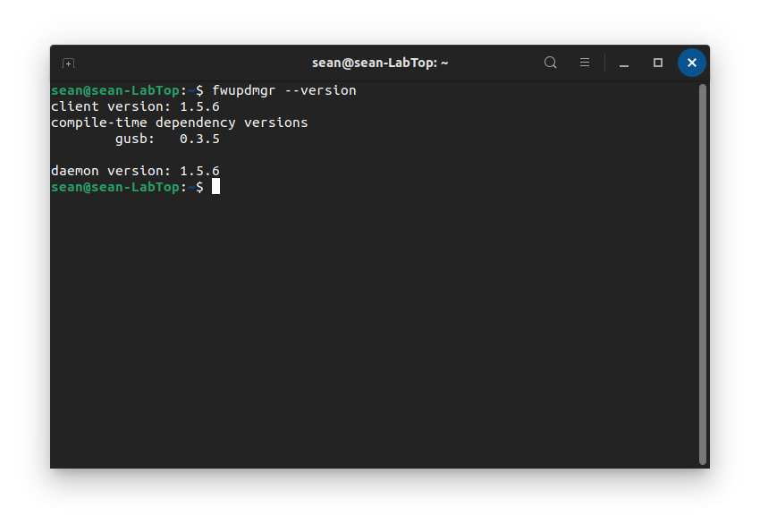
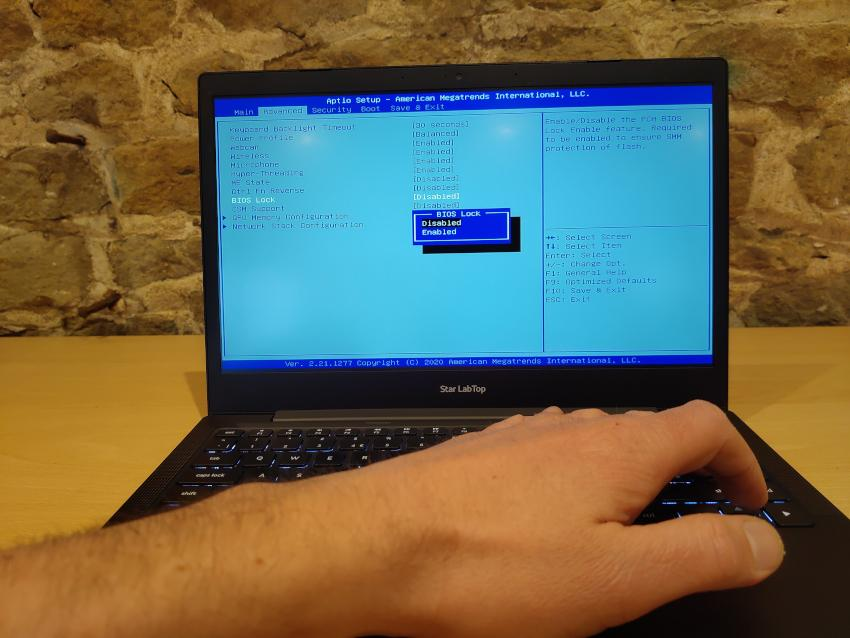
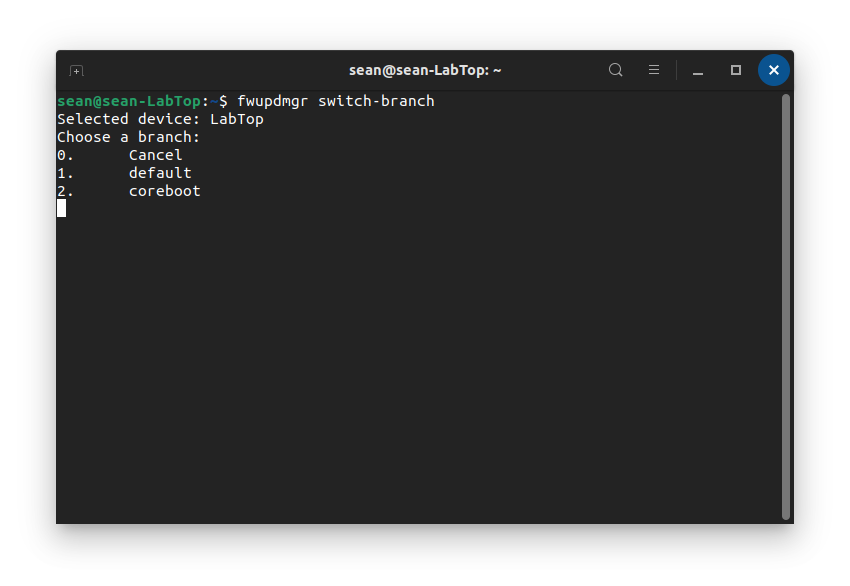

# Flashing with fwupd

#### **Requirements:**

* fwupd version 1.5.6 or later
* The battery must be charged to at least 30%
* The charger must be connected (either USB-C or DC Jack)
* BIOS Lock must be disabled
* Supported Linux distribution (Ubuntu 20.04 +, Linux Mint 20.1 + elementaryOS 6 +, Manjaro 21+)

**fwupd 1.5.6 or later**
To check the version of **fwupd** you have installed, open a terminal window and enter the below command:

```
fwupdmgr --version
```

This will show the version number. **1.5.6** or greater will work.

On Ubuntu 20.04, Ubuntu 20.10, Linux Mint 20.1 and elementaryOS 6, fwupd 1.5.6 can be installed from our PPA with the below terminal commands:

```
sudo add-apt-repository ppa:starlabs/ppa
sudo apt update
sudo apt install fwupd
```

On Manjaro:

```
sudo pacman -Sy fwupd-git flashrom-starlabs
```

Instructions for other distributions will be added once fwupd 1.5.6 is available. If you are not using one of the distributions listed above, it is possible to install coreboot using a Live USB.

**Disable BIOS Lock**
BIOS Lock must be disabled when switching from the standard AMI (American Megatrends Inc.) firmware to coreboot. To disable BIOS Lock:

1\. Start with your LabTop turned off\. Turn it on whilst holding the **F2** key to access the BIOS settings.
2\. When the BIOS settings load, use the arrow keys to navigate to the **Advanced** tab\. Here you will see **BIOS Lock**\.
3\. Press `Enter` to change this setting from **Enabled** to **Disabled**



4\. Next, press the `F10` key to **Save & Exit** and then `Enter` to confirm.

#### **Switching Branch**

Switching branch refers to changing from AMI firmware to coreboot, or vice versa.

First, check for new firmware files with the below terminal command:

```
fwupdmgr refresh --force
```

Then, to change branch, enter the below terminal command:

```
fwupdmgr switch-branch
```

You can then select which branch you would like to use, by typing in the corresponding number:

You will be prompted to confirm, press `y` to continue or `n` to cancel.

Once the switch has been completed, you will be prompted to restart.

The next reboot can take up to **5 minutes,** do not interrupt this process or disconnect the charger. Once the reboot is complete, that's it - you'll continue to receive updates for whichever branch you are using.

You can switch branch at any time.
