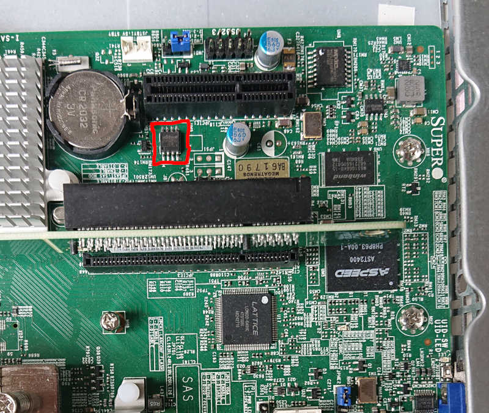

# Supermicro X11SSH-TF

This section details how to run coreboot on the [Supermicro X11SSH-TF].

## Required proprietary blobs

* [Intel FSP2.0]
* Intel ME

## Flashing coreboot

The board can be flashed externally using *some* programmers.
The CH341 was found working, while Dediprog won't detect the chip.

For more details have a look at the [flashing tutorial].

The flash IC can be found between the two PCIe slots near the southbridge:


## BMC (IPMI)

This board has an ASPEED [AST2400], which has BMC functionality. The
BMC firmware resides in a 32 MiB SOIC-16 chip in the corner of the
mainboard near the [AST2400]. This chip is an [MX25L25635F].

## Known issues

- Intel SGX causes secondary APs to crash (disabled for now).
- Tianocore doesn't work with Aspeed NGI, as it's text mode only.
- After S5 resume coreboot detects more DIMMs than installed, causing FSP-M
  to fail.

## Tested and working

- USB ports
- M.2 2280 NVMe slot
- 2x 10GB Ethernet
- SATA
- RS232
- VGA on Aspeed
- Super I/O initialisation
- ECC DRAM detection
- PCIe slots
- TPM on TPM expansion header
- BMC (IPMI)

## Technology

```eval_rst
+------------------+--------------------------------------------------+
| CPU              | Intel Kaby Lake                                  |
+------------------+--------------------------------------------------+
| PCH              | Intel C236                                       |
+------------------+--------------------------------------------------+
| Super I/O        | ASPEED AST2400                                   |
+------------------+--------------------------------------------------+
| Coprocessor      | Intel SPS (server version of the ME)             |
+------------------+--------------------------------------------------+
| Coprocessor      | ASPEED AST2400                                   |
+------------------+--------------------------------------------------+
```

## Extra links

- [Board manual]

[AST2400]: https://www.aspeedtech.com/products.php?fPath=20&rId=376
[Board manual]: https://www.supermicro.com/manuals/motherboard/C236/MNL-1783.pdf
[flashrom]: https://flashrom.org/Flashrom
[MX25L25635F]: https://media.digikey.com/pdf/Data%20Sheets/Macronix/MX25L25635F.pdf
[N25Q128A]: https://www.micron.com/~/media/Documents/Products/Data%20Sheet/NOR%20Flash/Serial%20NOR/N25Q/n25q_128mb_3v_65nm.pdf
[flashing tutorial]: ../../flash_tutorial/ext_power.md
[Intel FSP2.0]: ../../soc/intel/fsp/index.md
[Supermicro X11SSH-TF]: https://www.supermicro.com/en/products/motherboard/X11SSH-TF
