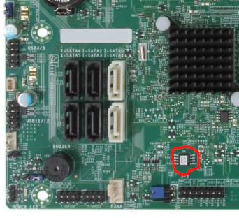

# Supermicro X9SAE and X9SAE-V

This page describes how to run coreboot on the Supermicro [X9SAE] and [X9SAE-V]

## Flashing coreboot

```eval_rst
+---------------------+----------------+
| Type                | Value          |
+=====================+================+
| Socketed flash      | occasionally   |
+---------------------+----------------+
| Model               | W25Q128FVSG    |
+---------------------+----------------+
| Size                | 16 MiB         |
+---------------------+----------------+
| Package             | SOIC-8         |
+---------------------+----------------+
| Write protection    | no             |
+---------------------+----------------+
| Dual BIOS feature   | no             |
+---------------------+----------------+
| Internal flashing   | yes            |
+---------------------+----------------+
```

The flash IC is located between the PCH and the front panel connector,
(circled) sometimes it is socketed.


### How to flash

Unlike ordinary desktop boards, the BIOS version 2.00 of X9SAE-V does not
apply any write protection, so the main SPI flash can be accessed using
[flashrom], and the whole flash is writable.

Note: If you are going to modify the ME region via internal programming, you had
better disable ME functionalities as much as possible in the vendor firmware
first, otherwise ME may write something back and break the firmware you write.

The following command may be used to flash coreboot. (To do so, linux kernel
could be started with `iomem=relaxed` or unload the `lpc_ich` kernel module)

Now you can [flash internally]. It is recommended to flash only the `bios`
region (use `--ifd -i bios -N` flashrom arguments), in order to minimize the
chances of messing something up in the beginning.

The flash chip is a SOIC-8 SPI flash, and may be socketed, so it's also easy
to do in-system programming, or remove and flash externally if it is socketed.

## Difference between X9SAE and X9SAE-V
On X9SAE PCI-E slot 4 is absent. Lane 9~16 of PCI-E slot 6 on X9SAE are wired
to slot 4 on X9SAE-V. Unlike ASUS P8C WS, there is no dynamic switch on X9SAE-V,
so on X9SAE-V slot 6 can work as x8 at most.

On X9SAE-V device pci 01.1 appears even if not defined in devicetree.cb, so it
seems that it shall not appear on X9SAE even if it is defined.

## Working (on my X9SAE-V)
- Intel Xeon E3-1225 V2 with 4 M391B1G73BH0-YK0 UDIMMs, ECC confirmed active
- PS/2 keyboard with SeaBIOS 1.14.0 and Debian GNU/Linux with kernel 5.10.46
- Use PS/2 keyboard and mouse simutaneously with a PS/2 Y-cable
- Both Onboard NIC
- S3 Suspend to RAM
- USB2 on rear and front panel connectors
- USB3
- Integrated SATA
- CPU Temp sensors (tested PSensor on GNU/Linux)
- LPC TPM on TPM-header (tested tpm-tools with TPM 1.2 Infineon SLB9635TT12)
- Native raminit
- Integrated graphics with libgfxinit
- Nvidia Quadro 600 in all PCIe-16x slots
- Compex WLM200NX (Qualcomm Atheros AR9220) in PCI slot
- Debug output from serial port

## Untested

- EHCI debugging
- S/PDIF audio
- PS/2 mouse

## Technology

```eval_rst
+------------------+--------------------------------------------------+
| Northbridge      | :doc:`../../northbridge/intel/sandybridge/index` |
+------------------+--------------------------------------------------+
| Southbridge      | bd82x6x                                          |
+------------------+--------------------------------------------------+
| CPU              | model_206ax                                      |
+------------------+--------------------------------------------------+
| Super I/O        | Nuvoton NCT6776F                                 |
+------------------+--------------------------------------------------+
| EC               | None                                             |
+------------------+--------------------------------------------------+
| Coprocessor      | Intel Management Engine                          |
+------------------+--------------------------------------------------+
```

## Extra resources

- [Flash chip datasheet][W25Q128FVSG]

[X9SAE]: https://www.supermicro.com/products/motherboard/xeon/c216/x9sae.cfm
[X9SAE-V]:  https://www.supermicro.com/products/motherboard/xeon/c216/x9sae-v.cfm
[W25Q128FVSG]: https://static.chipdip.ru/lib/093/DOC001093213.pdf
[flashrom]: https://flashrom.org/Flashrom
[flash internally]: ../../flash_tutorial/int_flashrom.md
