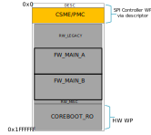
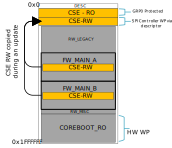

CSE FW update mechanism for devices in field

## Introduction

CSE Firmware and PMC Firmware are critical components of Intel SoCs.
CSE and PMC cooperate by providing platform services during boot and other
power transition flows.

## Problem Statement

Currently, on ChromiumOS Systems, CSE region is not updatable. So, new CSE FW
versions that are released by Intel to address important functional and security
bugs post-product launch will not be available to the end-user. Hence, the proposed
solution allows in-field CSE FW update to propagate those bug fixes
to end user platforms.

## Design Proposal

### CSE FW design Proposal:

Key Elements:

- CSE FW layout is composed of two bootable partitions (RO Recovery Partition
  and RW Normal Partition).

- Boot partition selection: An API-based mechanism is used to decide from which partition
  CSE will boot.

- The HECI APIs below will be supported in this CSE FW:

    - HMRFPO_ENABLE: This command requests the CSE enter a mode in which writes to
    the CSE region from the CSE are disabled. It also grants temporary write access
    to the RW partition from the host (RO is still protected by GPR0).

    - GET_PARTITION_INFO: The command retrieves information for each boot partition from CSE
    like version, start/end offsets of a partition within CSE region, and boot
    partition status. Also, it provides below information:
	    - The current boot partition which was used during this boot,
	    - The boot partition that will be used on the next CSE reset
	    - The number of boot partitions available in the CSE region

    - SET_BOOT_PARTITION_INFO: This command allows the firmware to request the
    CSE to boot from either its RO or RW partition at its next reset.

    - DATA_CLEAR: This command requests the CSE to reset its data partition back
    to manufacturing defaults

FW Layout, RW/RO Partitions:

The CSE RO partition is the first in the CSE boot order, hence it will be used
out of G3. RO partition contains minimum CSE code capable to boot platform and
execute FW update of RW partition. In addition to CSE code, the RO partition also
contains PMC FW patch and other CSE-loadable platform FW components.

RW partition contains fully operational CSE FW, PMC FW, other CSE loadable
platform FW components.

Boot partition selection:

CSE FW shall support 2 APIs to get boot partition info, and set boot partition
info to notify CSE to select the partition on the next boot.

### HOST FW Design proposal:

Key Elements:

- Build time artifacts:

    CSE RW Version update binary - The FW shall pack CSE RW update blob and
    corresponding version binary which contains version of the CSE RW blob.

- FW Update:

    coreboot will implement the logic to compare the CSE's FW version with CBFS
    CSE RW binary's version in the firmware slot (FW_MAIN_A/FW_MAIN_B) and update
    the CSE RW region if there is a version mismatch. If there is no version
    mismatch, firmware skips CSE FW update.

- Handling of CSE FW Downgrade:

  coreboot will send DATA_CLEAR HECI command when there is a CSE FW downgrade.
  This must be done to avoid data mismatch due to CSE FW downgrade. Further,
  CSE will restore the data back to manufacturing defaults after data reset.

## Implementation Details

To enable CSE FW update flow the following changes are required in coreboot:

* Descriptor change may be required to accommodate CSE binary. The CSE binary is tied with
a platform. So CSE size may vary from one platform to another.
* FMAP changes may be required to accommodate CSE binary and CSE RW blob in the RW CBFS region.
Please check platform specific CSE kit for CSE binary information.
* CSE Lite SKU binary and CSE RW blob
* Makefile change to pack CSE RW binaries in the CBFS
* Implementation of update flow:
 - Get CSE boot partition info using GET_BOOT_PARTITION_INFO HECI command.
 - Get the cbfs_me_rw.version from the currently selected RW slot.
 - If the version from the above 2 locations don't match, then start CSE FW update.
	 - If CSE is not booting from RO, then
		- Set the CSE's next boot partition to RO using SET_BOOT_PARTITION_INFO
        HECI command.
		- Send GLOBAL_RESET HECI command to reset the system.
	 - If RW update is a CSE FW downgrade, then coreboot has to send
        DATA_CLEAR command to clear run time data of CSE.
	 - Enable HMRFPO Mode (Host ME Region Flash Protection Override) by
        sending HMRFPO_ENABLE HECI command to CSE.
	 - Erase and Copy the CBFS CSE RW to CSE RW partition
     - Set CSE's next boot partition to RW.
	 - Trigger Global Reset which resets both CSE and Host.
	Then system should boot with the updated CSE.

* The resulting flash layout is shown below:

 

 - Typical boot flow

   - Vboot selects the RW FW (FW_MAIN_A or FW_MAIN_B) to boot.
   - coreboot skips CSE FW update flow if boot mode is recovery.
   - If CSE RW blob is not locatable in the CBFS, then RW Firmware skips update flow
     and sends SET_BOOT_PARTITION_INFO command to switch CSE to boot from RW
     and issues Global Reset if CSE is already not booting from RW partition.
   - The RW firmware will compare the CSE RW version with CSE RW blob in the slot.
   - If there is a mismatch, then firmware will carry out update flow as explained before.
