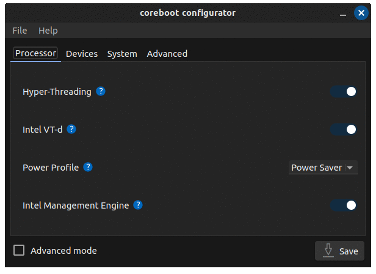

# coreboot-configurator 

A simple GUI to change settings in coreboot's CBFS, via the nvramtool utility.


# How to install
## Ubuntu, Linux Mint, elementary OS, Zorin OS and other derivates
##### Install
```
sudo add-apt-repository ppa:starlabs/coreboot
sudo apt update
sudo apt install coreboot-configurator
```
##### Uninstall
```
sudo apt purge coreboot-configurator
```

## Debian 11 / MX Linux 19
##### Install
```
cd /tmp
wget https://github.com/StarLabsLtd/packages/raw/main/Debian/11/coreboot-configurator_9%2Bf_all.deb \
	https://github.com/StarLabsLtd/packages/raw/main/Debian/11/nvramtool_1_all.deb
sudo dpkg -i *.deb
sudo apt -f install
```

##### Uninstall
```
sudo apt purge coreboot-configurator
```

## Manjaro
##### Install
```
sudo pamac install coreboot-configurator
```
##### Uninstall
```
sudo pamac remove coreboot-configurator
```

## Other Distributions
##### Install
```
git clone https://github.com/StarLabsLtd/coreboot-configurator.git
cd coreboot-configurator
meson build
ninja -C build install
```
##### Uninstall
```
sudo ninja -C uninstall
```

# Advanced Mode
Enabling advanced mode will all you to see all settings contained inside coreboot. Tread carefully :)

## Copying or Reusing
Included scripts are free software licensed under the terms of the [GNU General Public License, version 2](https://www.gnu.org/licenses/gpl-2.0.txt).

# [© Star Labs® / All Rights Reserved.](https://starlabs.systems)
Any issues or questions, please contact us at [support@starlabs.systems](mailto:supportstarlabs.systems)

View our full range of Linux laptops at: [https://starlabs.systems](https://starlabs.systems)
